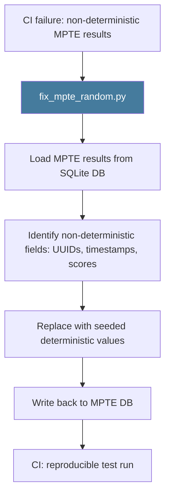

# PRD: Community 479 — scripts/fix_mpte_random.py

## Master Goal Mapping
**ALDECI Pillar**: MPTE — Test Fixture Repair  
**Persona**: Developer, QA Engineer  
**Business Value**: Fixes MPTE (Multi-Platform Testing Environment) test results that contain non-deterministic random data, replacing them with seeded deterministic values to enable reproducible CI test runs.

## Architecture Diagram


## Code Proof
**File**: `scripts/fix_mpte_random.py`  
Key responsibilities:
- Connect to MPTE SQLite database
- Find records with random UUIDs or floating scores
- Replace with seeded values using `random.seed(42)`
- Commit changes

## Inter-Dependencies
- **Upstream**: MPTE SQLite database (`data/mpte.db`)
- **Downstream**: CI test suite reproducibility
- **Sibling**: `seed_mpte_results.py` (Community 465 — initial seeding)

## Data Flow
```
fix_mpte_random.py
  → connect to data/mpte.db
  → SELECT * FROM mpte_results WHERE score IS NULL OR id LIKE 'rand%'
  → UPDATE: set deterministic id=f"mpte-{hash(row_pk)}", score=seeded_float
  → COMMIT
  → print: "Fixed 15 non-deterministic records"
```

## Referenced Docs
- `scripts/fix_mpte_random.py`
- `scripts/seed_mpte_results.py` (Community 465)

## Acceptance Criteria
- [ ] Identifies and fixes non-deterministic UUIDs and scores
- [ ] Uses `random.seed(42)` for reproducibility
- [ ] Idempotent (re-run produces same results)
- [ ] Reports count of fixed records
- [ ] Does not corrupt valid deterministic records

## Effort Estimate
**XS** — 0.5 days. Script exists; verify against current MPTE schema.

## Status
**EXISTS** — Script present. Verify MPTE schema compatibility.
