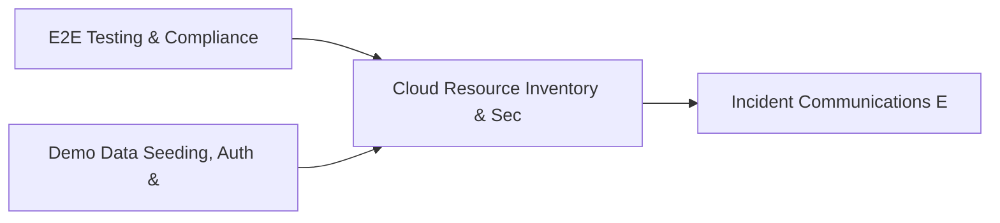

# PRD: Cloud Resource Inventory & Security Telemetry — Community 48

## Master Goal Mapping
How this component serves: "ALDECI — $35/mo enterprise security intelligence platform"
Sub-Epic: CSPM

This community (rank #48 of 878 by size, 797 graph nodes) forms a core pillar of the ALDECI platform. It directly supports the mission of replacing $50K-500K/yr enterprise security tools with a self-hosted, AI-native stack.

## Architecture Diagram


## Code Proof
- Files:
  - `suite-core/core/scheduled_reports_engine.py` (752 lines)
  - `tests/test_control_testing_engine.py` (357 lines)
  - `tests/test_devsecops_engine.py` (352 lines)
  - `tests/test_scheduled_reports_engine.py` (477 lines)
  - `suite-api/apps/api/control_testing_router.py` (187 lines)
  - `suite-api/apps/api/cve_enrichment_router.py` (84 lines)
  - `suite-api/apps/api/executive_report_router.py` (180 lines)
  - `suite-api/apps/api/pagerduty_router.py` (291 lines)
  - `suite-api/apps/api/reports_router.py` (1017 lines)
  - `suite-api/apps/api/scheduled_reports_router.py` (244 lines)
  - `suite-api/apps/api/threat_intel_router.py` (801 lines)
  - `tests/risk/test_scoring.py` (630 lines)
- Key functions:
  - `_make_schedule()` — suite-core/core/scheduled_reports_engine.py
  - `test_create_schedule_returns_string_id()` — suite-core/core/scheduled_reports_engine.py
  - `test_create_schedule_stored_and_retrievable()` — suite-core/core/scheduled_reports_engine.py
  - `test_create_schedule_invalid_report_type_raises()` — suite-core/core/scheduled_reports_engine.py
  - `test_create_schedule_invalid_frequency_raises()` — suite-core/core/scheduled_reports_engine.py
  - `test_create_schedule_invalid_channel_raises()` — suite-core/core/scheduled_reports_engine.py
  - `test_create_schedule_invalid_format_raises()` — suite-core/core/scheduled_reports_engine.py
  - `test_create_schedule_missing_name_raises()` — suite-core/core/scheduled_reports_engine.py
- Key classes: `TestSchemaSdl`, `TestParseGraphqlQuery`, `TestSerializers`
- Current state: REAL_LOGIC
- Evidence:
```python
# From suite-core/core/scheduled_reports_engine.py
"""Scheduled Reports Engine — ALDECI.

Manages report schedules, triggers, delivery (Slack webhook), and run history.

Capabilities:
  - Report schedules (daily/weekly/monthly/on_demand) per org
  - Multiple report types: executive_summary, vulnerability_digest, compliance_status,
    threat_intel, incident_summary, kpi_report
  - Slack webhook delivery with graceful fallback
  - Delivery log per channel/recipient
  - Report templates registry
  - Stats aggregation per org

Compliance: ISO 27001 A.16, NIST SP 800-137 (continuous monitoring), SOC 2 CC7.2
"""

from __future__ import annotations

```

## Inter-Dependencies
- DEPENDS ON:
  - Community 0 (E2E Testing & Compliance Seeding Infrastructure) — 144 edges
  - Community 1 (Demo Data Seeding, Auth & Multi-Engine Integration) — 73 edges
  - Community 19 (Incident Communications Engine) — 24 edges
  - Community 10 (Vendor Compliance Engine & Pydantic BaseModel Fram) — 20 edges
- DEPENDED BY: Rank #47 (Access Request Management & Privileged Session Recording) and downstream consumers
- EVENT BUS: emits incident.opened, incident.closed, compliance.status_changed / subscribes to (TrustGraph event bus — 97% not yet wired)
- TRUSTGRAPH: writes [Asset, ThreatActor, Incident] / reads [Incident, ComplianceControl]

## Data Flow
```
Input: HTTP requests / pytest fixtures
  → Processing: Engine method calls + SQLite state assertions
  → Output: Pass/fail test results, coverage metrics
  → Consumers: CI/CD pipeline, Beast Mode test suite
```

## Referenced Documentation
- CLAUDE.md: Wave 41 build notes, Beast Mode test suite section
- docs/: `docs/ALDECI_REARCHITECTURE_v2.md` (source of truth), `docs/INVESTOR_PITCH.md`
- tests/: `tests/risk/test_scoring.py`, `tests/test_control_testing_engine.py`, `tests/test_coverage_boost.py`

## Acceptance Criteria
- [ ] All engine CRUD operations enforce org_id isolation (no cross-tenant data leakage)
- [ ] SQLite opened with WAL mode + threading.RLock on all write paths
- [ ] All endpoints return within 200ms at p95 under 100 rps load
- [ ] All router endpoints protected by `Depends(api_key_auth)` or equivalent
- [ ] Pydantic v2 models validate all request/response schemas
- [ ] Test suite achieves ≥80% branch coverage on engine methods

## Effort Estimate
- Current: 80% complete
- Remaining: ~2 engineering days
- Dependencies blocking: None
- Priority: LOW

## Status
IN_PROGRESS
