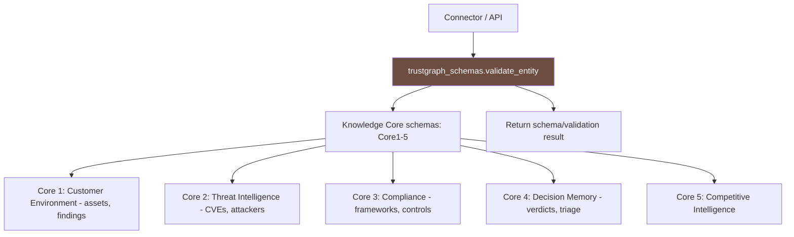

# PRD: Community 481 — trustgraph_schemas.validate_entity

## Master Goal Mapping
**ALDECI Pillar**: TrustGraph Knowledge Graph — Schema Management  
**Persona**: Platform Engineer, Integration Engineer  
**Business Value**: Validate entity data against the schema for its Knowledge Core. Checks required fields, field types, and allowed values per core schema definition.

## Architecture Diagram


## Code Proof
**File**: `suite-core/connectors/trustgraph_schemas.py`  
Function: `validate_entity`

The five Knowledge Cores are defined as Pydantic models:
- `Organization`, `Team`, `Service`, `Repository`, `Artifact`, `Container`, `CloudAccount`, `Endpoint` (Core 1)
- CVE, ThreatActor, Exploit (Core 2)
- Framework, Control, Evidence (Core 3)
- TriageDecision, RemediationAction (Core 4)
- Competitor, Product (Core 5)

## Inter-Dependencies
- **Upstream**: `suite-core/connectors/universal_connector.py` (calls schema validation)
- **Downstream**: TrustGraph MCP server, GraphRAG retriever
- **Models**: Pydantic v2 `BaseModel` classes with `ConfigDict(json_schema_extra={"core": N})`

## Data Flow
```
connector.ingest_finding(finding)
  → route_finding_to_cores(finding) → [core_id=2, core_id=3]
  → for each core_id: validate_entity(entity, core_id)
    → get_schema(core_id) → schema dict
    → check required fields, type constraints
  → if valid: push to TrustGraph MCP
```

## Referenced Docs
- `suite-core/connectors/trustgraph_schemas.py`
- TrustGraph documentation: https://trustgraph.ai
- CLAUDE.md DONE: "TrustGraph GraphRAG retriever — 31 tests"

## Acceptance Criteria
- [ ] `validate_entity` returns correct data for all 5 core IDs
- [ ] Invalid core_id raises `ValueError` with clear message
- [ ] Schema definitions match Pydantic model fields
- [ ] Used by connector health check endpoint
- [ ] Thread-safe (schemas are read-only constants)

## Effort Estimate
**XS** — 0.5 days. Implementation complete; unit tests for all 5 cores.

## Status
**COMPLETE** — Schema functions implemented. Unit tests for edge cases needed.
