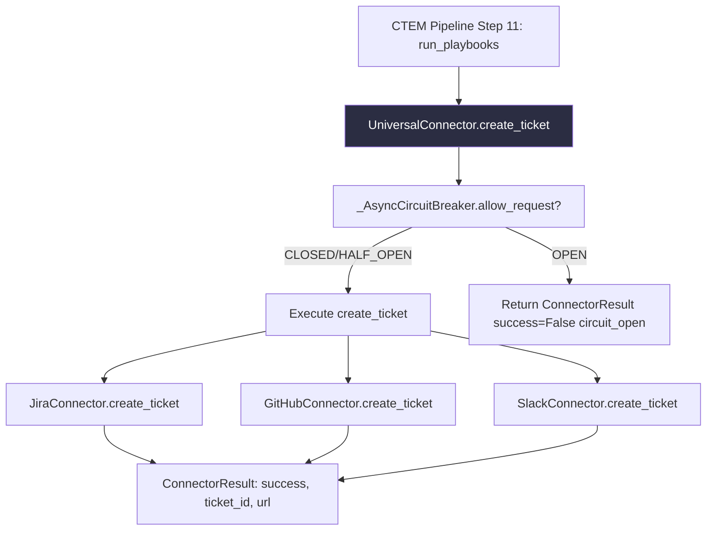

# PRD: Community 489 — UniversalConnector.create_ticket

## Master Goal Mapping
**ALDECI Pillar**: Integration — Universal Connector Framework  
**Persona**: Integration Engineer, DevOps Engineer  
**Business Value**: Create a ticket/issue/notification from a security finding in the target system (Jira, GitHub Issues, Slack). Maps ALDECI severity to platform-specific priority/label.

## Architecture Diagram


## Code Proof
**File**: `suite-core/connectors/universal_connector.py`  
Abstract method — implemented by JiraConnector, GitHubConnector, SlackConnector.

Key design patterns:
- `httpx.AsyncClient` for all HTTP (non-blocking)
- `_AsyncCircuitBreaker`: CLOSED → OPEN after 5 failures, HALF_OPEN after 30s recovery
- `_sanitise_text()` strips control chars, limits description to 32KB
- `_mask_secret()` ensures tokens never appear in logs
- Independent error isolation: each connector fails independently

## Inter-Dependencies
- **Upstream**: CTEM pipeline `run_playbooks` step, playbook engine
- **Downstream**: Jira Cloud REST API v3, GitHub Issues API, Slack Block Kit webhooks
- **Auth**: API keys from `ALDECIConfig` (JIRA_TOKEN, GITHUB_TOKEN, SLACK_WEBHOOK_URL)
- **Sibling**: `trustgraph_schemas.py` (finding routing)

## Data Flow
```
finding = SecurityFinding(severity="critical", title="CVE-2024-1234 in log4j")
  → safe_create_ticket(finding)
    → circuit_breaker.allow_request() → True (CLOSED)
    → create_ticket(finding)
      → map severity: critical → Jira priority P1
      → POST /rest/api/3/issue {"fields": {"summary": "...", "priority": "P1"}}
      → return ConnectorResult(success=True, ticket_id="SEC-456", url="...")
    → circuit_breaker.record_success()
```

## Referenced Docs
- `suite-core/connectors/universal_connector.py`
- CLAUDE.md: "13 PULL + 7 bidirectional connectors"
- Jira REST API v3: https://developer.atlassian.com/cloud/jira/platform/rest/v3/

## Acceptance Criteria
- [ ] `create_ticket` returns `ConnectorResult` with `success` bool
- [ ] Circuit breaker opens after 5 consecutive failures
- [ ] Circuit breaker recovers after 30s (HALF_OPEN)
- [ ] `safe_create_ticket` never raises — always returns `ConnectorResult`
- [ ] Secrets masked in all log output
- [ ] Description sanitized (max 32KB, no control chars)

## Effort Estimate
**S** — 1-2 days per connector implementation. Abstract interface complete.

## Status
**COMPLETE** — Interface and circuit breaker implemented. Jira/GitHub/Slack implementations need integration tests.
