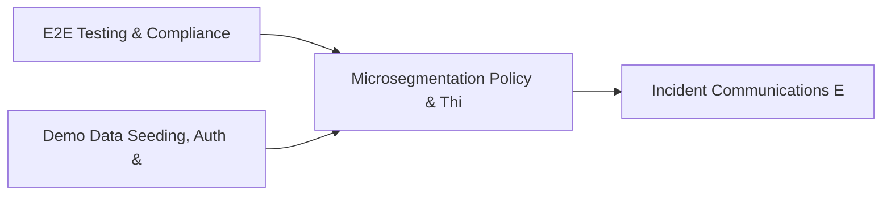

# PRD: Microsegmentation Policy & Third-Party Vendor Engine — Community 49

## Master Goal Mapping
How this component serves: "ALDECI — $35/mo enterprise security intelligence platform"
Sub-Epic: Network

This community (rank #49 of 878 by size, 748 graph nodes) forms a core pillar of the ALDECI platform. It directly supports the mission of replacing $50K-500K/yr enterprise security tools with a self-hosted, AI-native stack.

## Architecture Diagram


## Code Proof
- Files:
  - `suite-core/core/openclaw_engine.py` (1016 lines)
  - `suite-core/core/phishing_simulation_engine.py` (481 lines)
  - `suite-integrations/integrations/siem_engine.py` (470 lines)
  - `tests/test_awareness_campaign_engine.py` (354 lines)
  - `tests/test_deception_analytics_engine.py` (392 lines)
  - `tests/test_openclaw_engine.py` (493 lines)
  - `tests/test_pentest_mgmt_engine.py` (318 lines)
  - `tests/test_phishing_simulation_engine.py` (298 lines)
  - `suite-api/apps/api/awareness_campaign_router.py` (195 lines)
  - `suite-api/apps/api/openclaw_router.py` (221 lines)
  - `suite-api/apps/api/pentest_mgmt_router.py` (214 lines)
  - `suite-api/apps/api/pentest_router.py` (216 lines)
- Key functions:
  - `_sanitize_cef()` — suite-core/core/openclaw_engine.py
  - `format_cef()` — suite-core/core/openclaw_engine.py
  - `format_leef()` — suite-core/core/openclaw_engine.py
  - `format_json()` — suite-core/core/openclaw_engine.py
  - `get_siem_engine()` — suite-core/core/openclaw_engine.py
  - `_get_engine()` — suite-core/core/openclaw_engine.py
  - `add_target()` — suite-core/core/openclaw_engine.py
  - `list_targets()` — suite-core/core/openclaw_engine.py
- Key classes: `SIEMOutputFormat`, `SIEMTransport`, `SIEMSeverity`, `SIEMTarget`, `SIEMEvent`, `ForwardResult`
- Current state: REAL_LOGIC
- Evidence:
```python
# From suite-core/core/openclaw_engine.py
"""OpenClaw Autonomous Pentest Swarm Engine — ALDECI.

Orchestrates coordinated red team campaigns aligned to MITRE ATT&CK, with
up to 5 virtual operators running tasks across reconnaissance, initial access,
privilege escalation, lateral movement, collection, and exfiltration phases.

Capabilities:
  - Multi-phase campaign lifecycle (staged → running → paused → completed)
  - MITRE ATT&CK technique-mapped task queue per phase
  - 5-operator swarm coordination with specialization roles
  - Automatic finding generation from succeeded exploit tasks
  - Full multi-tenant isolation via org_id
  - S
```

## Inter-Dependencies
- DEPENDS ON:
  - Community 0 (E2E Testing & Compliance Seeding Infrastructure) — 142 edges
  - Community 1 (Demo Data Seeding, Auth & Multi-Engine Integration) — 29 edges
  - Community 19 (Incident Communications Engine) — 22 edges
  - Community 2 (API Router Gateway — Anomaly, Attack Simulation & ) — 10 edges
- DEPENDED BY: Rank #48 (Cloud Resource Inventory & Security Telemetry) and downstream consumers
- EVENT BUS: emits (none currently wired) / subscribes to (TrustGraph event bus — 97% not yet wired)
- TRUSTGRAPH: writes [ThreatActor, Identity] / reads [ThreatActor, Identity]

## Data Flow
```
Input: HTTP requests / pytest fixtures
  → Processing: Engine method calls + SQLite state assertions
  → Output: Pass/fail test results, coverage metrics
  → Consumers: CI/CD pipeline, Beast Mode test suite
```

## Referenced Documentation
- CLAUDE.md: Wave 41 build notes, Beast Mode test suite section
- docs/: `docs/ALDECI_REARCHITECTURE_v2.md` (source of truth), `docs/INVESTOR_PITCH.md`
- tests/: `suite-api/apps/api/pentest_mgmt_router.py`, `suite-api/apps/api/pentest_router.py`, `suite-core/core/pentest_scheduler.py`

## Acceptance Criteria
- [ ] All engine CRUD operations enforce org_id isolation (no cross-tenant data leakage)
- [ ] SQLite opened with WAL mode + threading.RLock on all write paths
- [ ] All endpoints return within 200ms at p95 under 100 rps load
- [ ] All router endpoints protected by `Depends(api_key_auth)` or equivalent
- [ ] Pydantic v2 models validate all request/response schemas
- [ ] Test suite achieves ≥80% branch coverage on engine methods

## Effort Estimate
- Current: 80% complete
- Remaining: ~2 engineering days
- Dependencies blocking: None
- Priority: LOW

## Status
IN_PROGRESS
