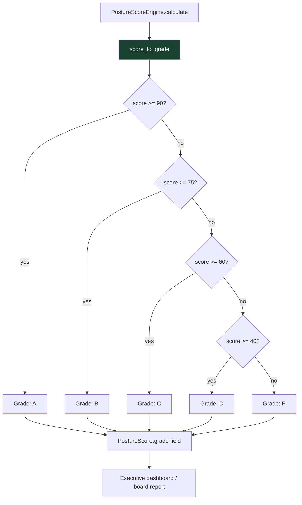

# PRD: Community 496 — posture_scoring.score_to_grade

## Master Goal Mapping
**ALDECI Pillar**: Security Posture Management — Grade Reporting  
**Persona**: CISO, Executive  
**Business Value**: Converts a 0-100 numeric posture score to an A-F letter grade for executive dashboards and board reports. The grade abstraction makes security posture immediately comprehensible to non-technical stakeholders.

## Architecture Diagram


## Code Proof
**File**: `suite-core/core/posture_scoring.py`  
```python
def score_to_grade(score: float) -> str:
    """Convert numeric score to letter grade."""
    if score >= 90:
        return "A"
    elif score >= 75:
        return "B"
    elif score >= 60:
        return "C"
    elif score >= 40:
        return "D"
    return "F"
```

## Inter-Dependencies
- **Upstream**: `PostureScoreEngine.calculate_score()` → overall_score
- **Downstream**: `PostureScore.grade` field, executive dashboards, CISO reports
- **Sibling**: `SecurityHealthScorecardEngine` (also uses A-F grading), `CompositeRiskScorer`

## Data Flow
```
engine.calculate_score(org_id, findings, mttr, compliance_pct, ...)
  → overall_score = weighted_sum(components) = 78.4
  → grade = score_to_grade(78.4) = "B"
  → PostureScore(overall_score=78.4, grade="B", ...)
  → GET /api/v1/posture-advisor/score → {"grade": "B", "score": 78.4}
```

## Referenced Docs
- `suite-core/core/posture_scoring.py`
- SOC2 CC7.2 (System monitoring and reporting)
- ALDECI PostureScoringDashboard frontend

## Acceptance Criteria
- [ ] score=90 → "A", score=89.9 → "B"
- [ ] score=75 → "B", score=74.9 → "C"
- [ ] score=60 → "C", score=59.9 → "D"
- [ ] score=40 → "D", score=39.9 → "F"
- [ ] score=0 → "F", score=100 → "A"
- [ ] Parametrized pytest with boundary values

## Effort Estimate
**XS** — 0.5 days. Function complete; add parametrized boundary tests.

## Status
**COMPLETE** — Implementation exists. Boundary tests needed.
