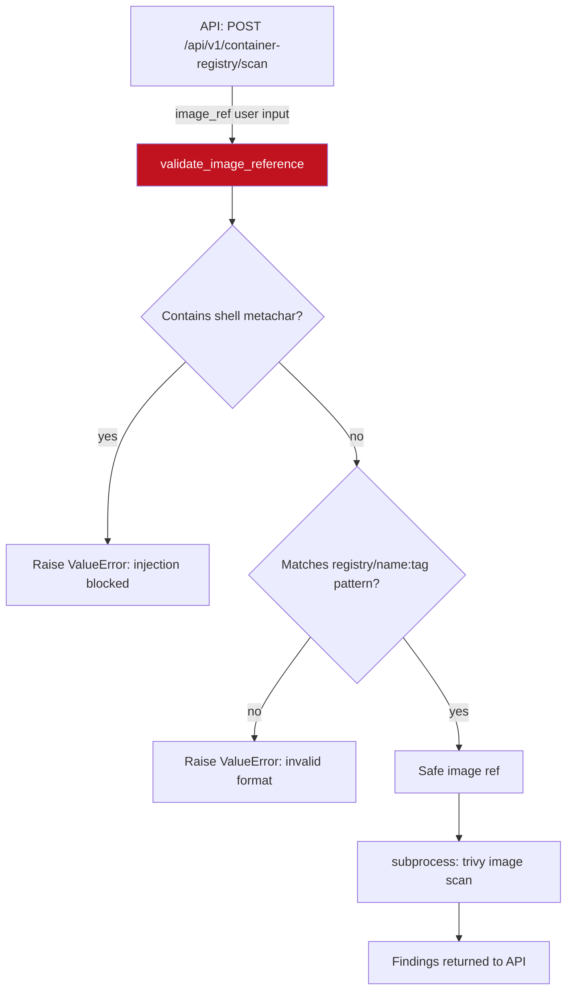

# PRD: Community 497 — container_scanner.validate_image_reference

## Master Goal Mapping
**ALDECI Pillar**: Container Security — SSRF/Injection Prevention  
**Persona**: Security Engineer, DevSecOps  
**Business Value**: Validates container image references before passing them to docker pull / trivy scan commands, preventing shell injection attacks where a malicious image name like `ubuntu; rm -rf /` could compromise the scanner host.

## Architecture Diagram


## Code Proof
**File**: `suite-core/core/container_scanner.py`  
```python
_BLOCKED_CHARS = re.compile(r'[;&|`$()\\<>'"\s]')
_IMAGE_PATTERN = re.compile(
    r'^[a-zA-Z0-9][a-zA-Z0-9._/-]*(?::[a-zA-Z0-9._-]+)?(?:@sha256:[a-f0-9]{64})?$'
)

def validate_image_reference(image_ref: str) -> str:
    """Validate container image reference to prevent shell injection.
    Blocks characters that could escape subprocess arguments."""
    if _BLOCKED_CHARS.search(image_ref):
        raise ValueError(f"Invalid image reference: contains blocked characters")
    if not _IMAGE_PATTERN.match(image_ref):
        raise ValueError(f"Invalid image reference format: {image_ref!r}")
    return image_ref
```

## Inter-Dependencies
- **Upstream**: Container registry scan API endpoint
- **Downstream**: `subprocess.run(["trivy", "image", validated_ref])` — safe shell invocation
- **Sibling**: `dast_engine.validate_target_url` (Community 505 — similar SSRF prevention)

## Data Flow
```
POST /api/v1/container-registry/scan {"image": "ubuntu:22.04"}
  → validate_image_reference("ubuntu:22.04")
    → no blocked chars ✓
    → matches pattern ✓
    → return "ubuntu:22.04"
  → subprocess.run(["trivy", "image", "ubuntu:22.04"], ...)

POST /api/v1/container-registry/scan {"image": "ubuntu; cat /etc/passwd"}
  → validate_image_reference("ubuntu; cat /etc/passwd")
    → _BLOCKED_CHARS.search → ";" found
    → raise ValueError("Invalid image reference: contains blocked characters")
  → 422 Unprocessable Entity
```

## Referenced Docs
- `suite-core/core/container_scanner.py`
- CWE-78: OS Command Injection
- NIST SP 800-53 SI-10 (Information Input Validation)

## Acceptance Criteria
- [ ] Blocks semicolons, pipes, backticks, $, parentheses, quotes, spaces
- [ ] Accepts: `ubuntu:22.04`, `registry.io/org/image:v1.2.3`, `nginx@sha256:abc...`
- [ ] Rejects: `ubuntu; rm -rf /`, `$(malicious)`, `image\'`
- [ ] Raises `ValueError` with clear message on rejection
- [ ] Returns original string unchanged on success (no mutation)

## Effort Estimate
**XS** — 0.5 days. Implementation complete; security-focused parametrized tests.

## Status
**COMPLETE** — Implementation exists. Security regression tests needed.
