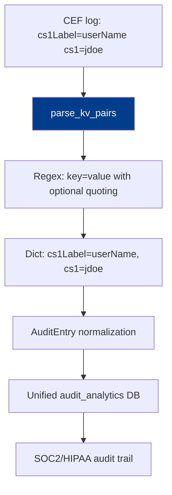

# PRD: Community 498 — audit_analytics.parse_kv_pairs

## Master Goal Mapping
**ALDECI Pillar**: Audit & Compliance — Log Normalization  
**Persona**: Security Analyst, Compliance Officer  
**Business Value**: Parses `key=value` pairs from CEF/LEEF syslog extension strings into Python dicts, enabling normalization of enterprise firewall and SIEM log formats into ALDECI's unified AuditEntry schema.

## Architecture Diagram


## Code Proof
**File**: `suite-core/core/audit_analytics.py`  
```python
def parse_kv_pairs(text: str) -> Dict[str, str]:
    """Parse key=value pairs from *text*."""
    pattern = re.compile(r'(\w+)=(?:"([^"]*)"|(\S+))')
    return {m.group(1): m.group(2) or m.group(3) for m in pattern.finditer(text)}
```

## Inter-Dependencies
- **Upstream**: CEF/LEEF log ingestor, syslog parser
- **Downstream**: `AuditEntry` normalization, FTS5 full-text search index
- **Sibling**: `parse_timestamp` (Community 499), `normalize_severity` (Community 500)

## Data Flow
```
CEF extension: "src=192.168.1.1 dst=10.0.0.1 cs1Label=user cs1=admin act=login"
  → parse_kv_pairs(extension_str)
    → {"src": "192.168.1.1", "dst": "10.0.0.1", "cs1Label": "user", "cs1": "admin", "act": "login"}
  → map to AuditEntry fields
```

## Referenced Docs
- `suite-core/core/audit_analytics.py`
- CEF standard: https://www.microfocus.com/documentation/arcsight/arcsight-smartconnectors/
- SOC2 CC7.2, HIPAA §164.312(b)

## Acceptance Criteria
- [ ] Parses unquoted values: `key=value`
- [ ] Parses quoted values: `key="value with spaces"`
- [ ] Handles multiple pairs in one string
- [ ] Returns empty dict for empty/None input
- [ ] Keys are strings, values are strings

## Effort Estimate
**XS** — 0.5 days. Function complete; add edge case tests.

## Status
**COMPLETE** — Implementation exists. Edge case tests (unicode, empty) needed.
