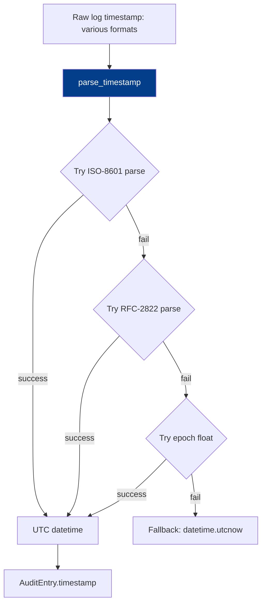

# PRD: Community 499 — audit_analytics.parse_timestamp

## Master Goal Mapping
**ALDECI Pillar**: Audit & Compliance — Timestamp Normalization  
**Persona**: Security Analyst  
**Business Value**: Parses diverse timestamp formats (ISO-8601, RFC-2822, epoch, syslog) from log sources into UTC datetime objects, ensuring consistent time ordering in audit trails across heterogeneous log sources.

## Architecture Diagram


## Code Proof
**File**: `suite-core/core/audit_analytics.py`  
```python
def parse_timestamp(raw: Optional[str]) -> datetime:
    """Best-effort timestamp parse; falls back to utcnow."""
    if not raw:
        return datetime.now(timezone.utc)
    for fmt in ("%Y-%m-%dT%H:%M:%S%z", "%Y-%m-%dT%H:%M:%SZ",
                "%Y-%m-%d %H:%M:%S", "%b %d %H:%M:%S"):
        try:
            dt = datetime.strptime(raw.strip(), fmt)
            return dt.replace(tzinfo=timezone.utc) if dt.tzinfo is None else dt
        except ValueError:
            continue
    try:
        return datetime.fromtimestamp(float(raw), tz=timezone.utc)
    except (ValueError, OSError):
        pass
    return datetime.now(timezone.utc)
```

## Inter-Dependencies
- **Upstream**: Log ingestor (syslog, CEF, JSON, LEEF)
- **Downstream**: `AuditEntry.timestamp`, forensic timeline builder, retention policy engine
- **Sibling**: `parse_kv_pairs` (Community 498), `normalize_severity` (Community 500)

## Data Flow
```
syslog: "Apr 16 14:32:01 host sshd[1234]: Failed password"
  → parse_timestamp("Apr 16 14:32:01")
    → strptime with "%b %d %H:%M:%S"
    → datetime(2026, 4, 16, 14, 32, 1, tzinfo=UTC)
  → AuditEntry.timestamp = 2026-04-16T14:32:01+00:00
```

## Referenced Docs
- `suite-core/core/audit_analytics.py`
- HIPAA §164.312(b) — audit controls requiring accurate timestamps

## Acceptance Criteria
- [ ] Parses ISO-8601 with timezone: `2026-04-16T14:32:01+00:00`
- [ ] Parses ISO-8601 UTC: `2026-04-16T14:32:01Z`
- [ ] Parses syslog format: `Apr 16 14:32:01`
- [ ] Parses Unix epoch: `1713276721.0`
- [ ] Returns `datetime.utcnow()` for unparseable input (no exception)
- [ ] All returned datetimes are timezone-aware (UTC)

## Effort Estimate
**XS** — 0.5 days. Function complete; parametrized tests for each format.

## Status
**COMPLETE** — Implementation exists. Parametrized format tests needed.
