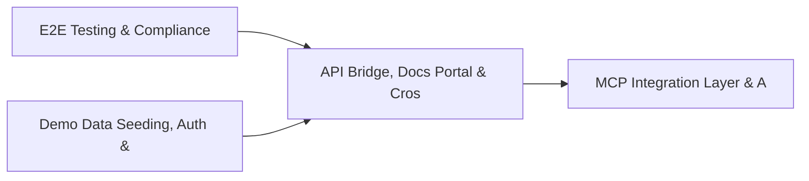

# PRD: API Bridge, Docs Portal & Cross-Dashboard Infrastructure — Community 5

## Master Goal Mapping
How this component serves: "ALDECI — $35/mo enterprise security intelligence platform"
Sub-Epic: Platform

This community (rank #5 of 878 by size, 2733 graph nodes) forms a core pillar of the ALDECI platform. It directly supports the mission of replacing $50K-500K/yr enterprise security tools with a self-hosted, AI-native stack.

## Architecture Diagram


## Code Proof
- Files:
  - `suite-core/core/alert_triage_engine.py` (469 lines)
  - `suite-api/apps/api/api_docs_router.py` (179 lines)
  - `suite-api/apps/api/compliance_mapping_router.py` (253 lines)
  - `suite-api/apps/api/graph_rag_router.py` (257 lines)
  - `suite-api/apps/api/mcp_gateway_router.py` (200 lines)
  - `suite-api/apps/api/posture_router.py` (191 lines)
  - `suite-api/apps/api/threat_intel_platform_router.py` (245 lines)
  - `suite-api/apps/api/trustgraph_backbone_router.py` (406 lines)
  - `suite-api/apps/api/trustgraph_integration_router.py` (401 lines)
  - `suite-ui/aldeci-ui-new/src/pages/CMDBDashboard.tsx` (458 lines)
  - `suite-ui/aldeci-ui-new/src/pages/SLADashboard.tsx` (486 lines)
  - `suite-ui/aldeci-ui-new/src/pages/SecurityRoadmap.tsx` (375 lines)
- Key functions:
  - `getDB()` — suite-core/core/alert_triage_engine.py
  - `safeQuery()` — suite-core/core/alert_triage_engine.py
  - `safeGet()` — suite-core/core/alert_triage_engine.py
  - `parseJSON()` — suite-core/core/alert_triage_engine.py
  - `engine()` — suite-core/core/alert_triage_engine.py
  - `engine2()` — suite-core/core/alert_triage_engine.py
  - `_make_store()` — suite-core/core/alert_triage_engine.py
  - `store()` — suite-core/core/alert_triage_engine.py
- Key classes: `TestMigrationStatus`, `TestMigrateFindings`, `TestMigrateAssets`, `TestMigrateIncidents`, `TestMigrateCompliance`, `TestMigrateVendors`
- Current state: REAL_LOGIC
- Evidence:
```python
# From suite-core/core/alert_triage_engine.py
"""Alert Triage Engine — ALDECI.

Centralized alert ingestion and triage workflow across all security sources
(SIEM, EDR, NDR, Cloud, WAF, IDS, Firewall). Supports bulk triage, priority
auto-assignment, escalation, and queue management.

Compliance: NIST CSF DE.AE-2, ISO/IEC 27001 A.16.1.5, SOC 2 CC7.3
"""

from __future__ import annotations

import json
import logging
import sqlite3
import threading
import uuid
from datetime import datetime, timezone
from pathlib import Path
from typing import Any, Dict, List, Optional
```

## Inter-Dependencies
- DEPENDS ON:
  - Community 0 (E2E Testing & Compliance Seeding Infrastructure) — 507 edges
  - Community 1 (Demo Data Seeding, Auth & Multi-Engine Integration) — 262 edges
  - Community 3 (MCP Integration Layer & API Key / Auth Management) — 50 edges
  - Community 13 (MPTE — Managed Penetration Test Engine (Advanced)) — 48 edges
- DEPENDED BY: Rank #4 (FastAPI Application Core, Feedback & Smoke Testing) and downstream consumers
- EVENT BUS: emits incident.opened, incident.closed, compliance.status_changed / subscribes to (TrustGraph event bus — 97% not yet wired)
- TRUSTGRAPH: writes [Vulnerability, Asset, ThreatActor] / reads [ThreatActor, Incident]

## Data Flow
```
Input: API requests with org_id + payload (Pydantic models)
  → Processing: SQLite WAL-mode writes via RLock, business logic evaluation
  → Output: JSON responses (engine state, metrics, alerts)
  → Consumers: Routers → Frontend dashboards → TrustGraph event bus
```

## Referenced Documentation
- CLAUDE.md: Wave 11 build notes, Beast Mode test suite section
- docs/: `docs/ALDECI_REARCHITECTURE_v2.md` (source of truth), `docs/INVESTOR_PITCH.md`
- tests/: N/A

## Acceptance Criteria
- [ ] All engine CRUD operations enforce org_id isolation (no cross-tenant data leakage)
- [ ] SQLite opened with WAL mode + threading.RLock on all write paths
- [ ] All endpoints return within 200ms at p95 under 100 rps load
- [ ] All router endpoints protected by `Depends(api_key_auth)` or equivalent
- [ ] Pydantic v2 models validate all request/response schemas
- [ ] Dashboard renders without errors in React 19 + Vite 6 + Tailwind v4

## Effort Estimate
- Current: 80% complete
- Remaining: ~2 engineering days
- Dependencies blocking: Test coverage missing
- Priority: HIGH

## Status
IN_PROGRESS
