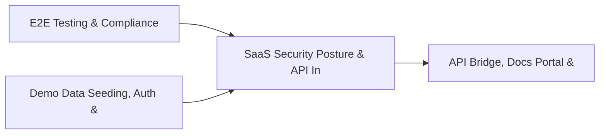

# PRD: SaaS Security Posture & API Inventory Engine — Community 50

## Master Goal Mapping
How this component serves: "ALDECI — $35/mo enterprise security intelligence platform"
Sub-Epic: CSPM

This community (rank #50 of 878 by size, 748 graph nodes) forms a core pillar of the ALDECI platform. It directly supports the mission of replacing $50K-500K/yr enterprise security tools with a self-hosted, AI-native stack.

## Architecture Diagram


## Code Proof
- Files:
  - `suite-core/core/control_testing_engine.py` (434 lines)
  - `suite-core/core/identity_risk_engine.py` (510 lines)
  - `suite-core/core/iga_engine.py` (747 lines)
  - `suite-core/core/security_posture_scoring_engine.py` (421 lines)
  - `suite-core/core/vuln_prioritization_engine.py` (572 lines)
  - `tests/test_ccm_engine.py` (297 lines)
  - `tests/test_cloud_identity_engine.py` (387 lines)
  - `tests/test_compliance_mapping_engine.py` (485 lines)
  - `suite-api/apps/api/ccm_router.py` (189 lines)
  - `suite-api/apps/api/cloud_identity_router.py` (214 lines)
  - `suite-api/apps/api/cloud_native_security_router.py` (176 lines)
  - `suite-api/apps/api/cnapp_router.py` (232 lines)
- Key functions:
  - `test_list_controls_empty()` — suite-core/core/control_testing_engine.py
  - `test_list_access_reviews_empty()` — suite-core/core/control_testing_engine.py
  - `engine()` — suite-core/core/control_testing_engine.py
  - `_make_identity()` — suite-core/core/control_testing_engine.py
  - `test_create_access_review_all()` — suite-core/core/control_testing_engine.py
  - `test_create_access_review_privileged()` — suite-core/core/control_testing_engine.py
  - `test_create_access_review_service_accounts()` — suite-core/core/control_testing_engine.py
  - `test_create_access_review_invalid_access_type()` — suite-core/core/control_testing_engine.py
- Key classes: N/A
- Current state: REAL_LOGIC
- Evidence:
```python
# From suite-core/core/control_testing_engine.py
"""Control Testing Engine — ALDECI. SQLite WAL + RLock + org_id isolation.

Tracks security control effectiveness through scheduled and ad-hoc testing.
  - Define security controls mapped to compliance frameworks
  - Run tests with pass/fail/partial results and effectiveness scoring
  - Rolling average effectiveness from last 5 tests
  - Auto-computes control status based on score thresholds
  - Schedule management for recurring control tests

Compliance: NIST SP 800-53 CA-2, ISO 27001 A.18.2, SOC2 CC4.1
"""
from __future__ import annotations

import logging
import sqlite3
import threading
imp
```

## Inter-Dependencies
- DEPENDS ON:
  - Community 0 (E2E Testing & Compliance Seeding Infrastructure) — 93 edges
  - Community 1 (Demo Data Seeding, Auth & Multi-Engine Integration) — 12 edges
  - Community 5 (API Bridge, Docs Portal & Cross-Dashboard Infrastr) — 11 edges
  - Community 32 (Mobile App Security & API Abuse Detection) — 11 edges
- DEPENDED BY: Rank #49 (Microsegmentation Policy & Third-Party Vendor Engine) and downstream consumers
- EVENT BUS: emits compliance.status_changed, user.risk_changed / subscribes to (TrustGraph event bus — 97% not yet wired)
- TRUSTGRAPH: writes [Vulnerability, Incident, Identity] / reads [Identity, ComplianceControl]

## Data Flow
```
Input: HTTP requests / pytest fixtures
  → Processing: Engine method calls + SQLite state assertions
  → Output: Pass/fail test results, coverage metrics
  → Consumers: CI/CD pipeline, Beast Mode test suite
```

## Referenced Documentation
- CLAUDE.md: Wave 41 build notes, Beast Mode test suite section
- docs/: `docs/ALDECI_REARCHITECTURE_v2.md` (source of truth), `docs/INVESTOR_PITCH.md`
- tests/: `tests/test_ccm_engine.py`, `tests/test_cloud_connectors.py`, `tests/test_cloud_identity_engine.py`

## Acceptance Criteria
- [ ] All engine CRUD operations enforce org_id isolation (no cross-tenant data leakage)
- [ ] SQLite opened with WAL mode + threading.RLock on all write paths
- [ ] All endpoints return within 200ms at p95 under 100 rps load
- [ ] All router endpoints protected by `Depends(api_key_auth)` or equivalent
- [ ] Pydantic v2 models validate all request/response schemas
- [ ] Test suite achieves ≥80% branch coverage on engine methods

## Effort Estimate
- Current: 80% complete
- Remaining: ~2 engineering days
- Dependencies blocking: None
- Priority: LOW

## Status
IN_PROGRESS
