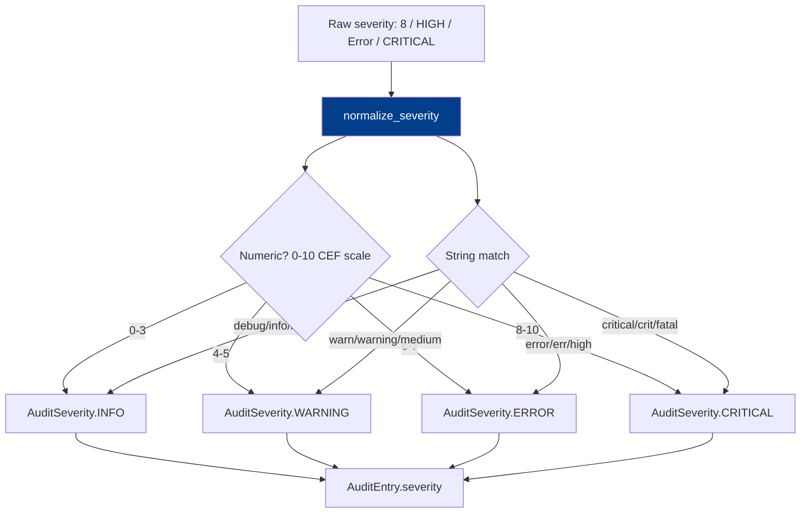

# PRD: Community 500 — audit_analytics.normalize_severity

## Master Goal Mapping
**ALDECI Pillar**: Audit & Compliance — Severity Normalization  
**Persona**: Security Analyst  
**Business Value**: Normalizes free-text severity strings from diverse log sources (CEF severities 0-10, syslog priorities, vendor-specific strings) to ALDECI's canonical AuditSeverity enum, enabling unified severity filtering across audit sources.

## Architecture Diagram


## Code Proof
**File**: `suite-core/core/audit_analytics.py`  
```python
def normalize_severity(raw: Optional[str]) -> AuditSeverity:
    """Normalise a free-text severity string to AuditSeverity."""
    if not raw:
        return AuditSeverity.INFO
    raw = raw.strip().lower()
    if raw.isdigit():
        n = int(raw)
        if n <= 3: return AuditSeverity.INFO
        if n <= 5: return AuditSeverity.WARNING
        if n <= 7: return AuditSeverity.ERROR
        return AuditSeverity.CRITICAL
    mapping = {
        "critical": AuditSeverity.CRITICAL, "crit": AuditSeverity.CRITICAL,
        "error": AuditSeverity.ERROR, "err": AuditSeverity.ERROR, "high": AuditSeverity.ERROR,
        "warning": AuditSeverity.WARNING, "warn": AuditSeverity.WARNING,
        "debug": AuditSeverity.DEBUG,
    }
    return mapping.get(raw, AuditSeverity.INFO)
```

## Inter-Dependencies
- **Upstream**: CEF/LEEF/syslog/JSON log ingestors
- **Downstream**: `AuditEntry.severity`, anomaly detection (off-hours ERROR/CRITICAL), FTS5 filtering
- **Sibling**: `parse_kv_pairs` (Community 498), `parse_timestamp` (Community 499)

## Data Flow
```
CEF: "severity=8"  → normalize_severity("8") → AuditSeverity.CRITICAL
JSON: "level":"error" → normalize_severity("error") → AuditSeverity.ERROR
Syslog priority 3 (ERR) → normalize_severity("3") → AuditSeverity.INFO (CEF 0-3=info)
```

## Referenced Docs
- `suite-core/core/audit_analytics.py`
- CEF specification (severity 0-10 scale)

## Acceptance Criteria
- [ ] Numeric "0"-"3" → DEBUG/INFO, "4"-"5" → WARNING, "6"-"7" → ERROR, "8"-"10" → CRITICAL
- [ ] "critical", "crit" → CRITICAL; "error", "err", "high" → ERROR
- [ ] "warning", "warn" → WARNING; "debug" → DEBUG
- [ ] None/empty → INFO (safe default)
- [ ] Unknown strings → INFO (safe default, no exception)

## Effort Estimate
**XS** — 0.5 days. Function complete; parametrized tests for all mappings.

## Status
**COMPLETE** — Implementation exists. Parametrized tests needed.
