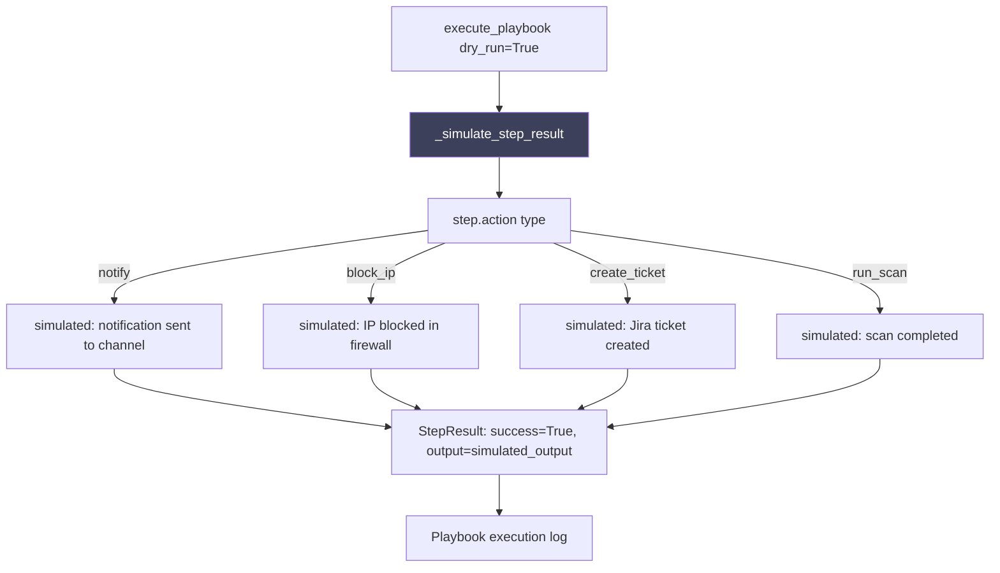

# PRD: Community 501 — security_playbook_engine._simulate_step_result

## Master Goal Mapping
**ALDECI Pillar**: SOAR — Playbook Simulation Mode  
**Persona**: Security Engineer, IR Team  
**Business Value**: Produces deterministic simulated step results for playbook dry-run mode, enabling teams to validate playbook logic and expected outputs without executing live actions against production systems.

## Architecture Diagram


## Code Proof
**File**: `suite-core/core/security_playbook_engine.py`  
```python
def _simulate_step_result(self, step: PlaybookStep) -> Dict[str, Any]:
    """Produce a simulated step result dict."""
    return {
        "step_id": step.id,
        "action": step.action,
        "status": "simulated",
        "success": True,
        "output": f"[DRY RUN] Would execute: {step.action} with params {step.params}",
        "executed_at": datetime.now(timezone.utc).isoformat(),
        "duration_ms": 0,
    }
```

## Inter-Dependencies
- **Upstream**: `execute_playbook(playbook_id, dry_run=True)`
- **Downstream**: Playbook execution log, frontend playbook tester
- **Sibling**: Live step executors (notify_step, block_ip_step, create_ticket_step)

## Data Flow
```
execute_playbook("ir-ransomware-v1", dry_run=True)
  → for each step in playbook.steps:
      result = _simulate_step_result(step)
      → {"status": "simulated", "output": "[DRY RUN] Would execute: block_ip ..."}
  → log all simulated results
  → return PlaybookRun(status="completed_dry_run", steps=simulated_results)
```

## Referenced Docs
- `suite-core/core/security_playbook_engine.py`
- CLAUDE.md DONE: "security_playbook_engine — 32 tests"

## Acceptance Criteria
- [ ] Returns dict with step_id, action, status="simulated", success=True
- [ ] Output field clearly prefixed with "[DRY RUN]"
- [ ] No side effects (no network calls, no DB writes for live actions)
- [ ] duration_ms=0 for simulated steps
- [ ] Works for all action types: notify, block_ip, create_ticket, run_scan

## Effort Estimate
**XS** — 0.5 days. Implementation complete; verify in dry-run integration test.

## Status
**COMPLETE** — Implementation exists. Dry-run integration test needed.
