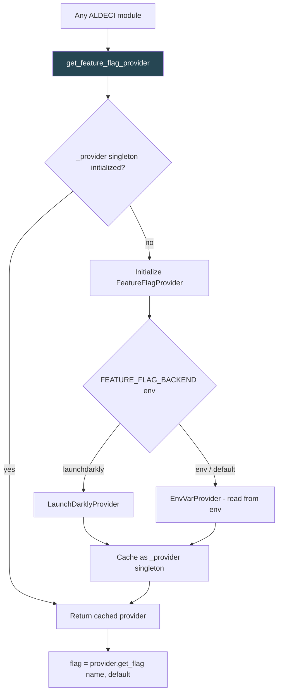

# PRD: Community 502 — configuration._get_feature_flag_provider

## Master Goal Mapping
**ALDECI Pillar**: Platform — Feature Flag Management  
**Persona**: Platform Engineer, CTO  
**Business Value**: Lazy-initializes the feature flag provider on first access, enabling runtime feature toggling (A/B tests, gradual rollouts, kill switches) without restart — supporting safe rollout of new engines and UI features across 30 personas.

## Architecture Diagram


## Code Proof
**File**: `suite-core/core/configuration.py`  
```python
_provider: Optional[FeatureFlagProvider] = None
_provider_lock = threading.Lock()

def _get_feature_flag_provider() -> FeatureFlagProvider:
    """Lazy-initialize feature flag provider."""
    global _provider
    if _provider is None:
        with _provider_lock:
            if _provider is None:
                backend = os.getenv("FEATURE_FLAG_BACKEND", "env")
                _provider = _create_provider(backend)
    return _provider
```

## Inter-Dependencies
- **Upstream**: `FEATURE_FLAG_BACKEND` env var
- **Downstream**: Any module calling `is_feature_enabled("feature_name")`
- **Thread safety**: Double-checked locking with `threading.Lock`

## Data Flow
```
# First call
is_feature_enabled("zero_trust_v2")
  → _get_feature_flag_provider()
    → _provider is None → acquire lock → create EnvVarProvider
    → cache _provider
  → provider.get_flag("zero_trust_v2", default=False)
  → os.getenv("FF_ZERO_TRUST_V2", "false") == "true" → True/False

# Subsequent calls — cached provider returned immediately
```

## Referenced Docs
- `suite-core/core/configuration.py`
- Double-checked locking pattern (GoF)

## Acceptance Criteria
- [ ] Singleton initialized exactly once even under concurrent access
- [ ] `FEATURE_FLAG_BACKEND=env` uses environment variable provider
- [ ] Returns cached provider on subsequent calls (no re-init)
- [ ] Thread-safe: concurrent calls produce one provider
- [ ] Provider can be reset in tests via `_reset_provider()` helper

## Effort Estimate
**XS** — 0.5 days. Implementation complete; thread-safety test needed.

## Status
**COMPLETE** — Implementation exists. Concurrent initialization test needed.
