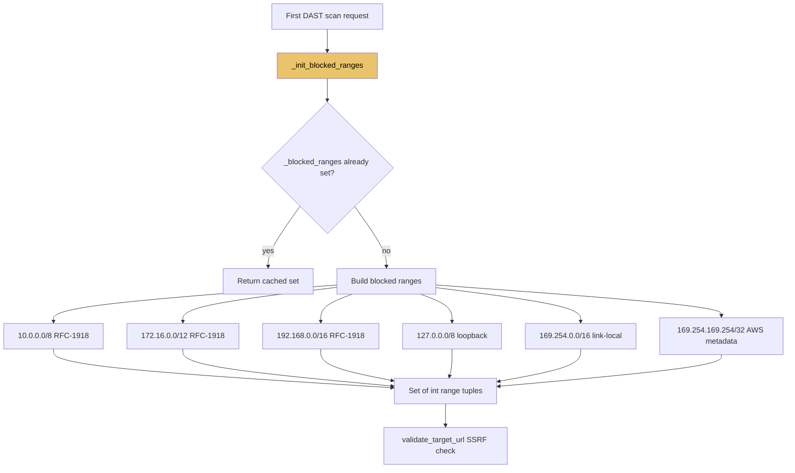

# PRD: Community 504 — dast_engine._init_blocked_ranges

## Master Goal Mapping
**ALDECI Pillar**: DAST — SSRF Prevention (Range Initialization)  
**Persona**: Security Engineer  
**Business Value**: Initializes the set of blocked IP ranges (RFC-1918 private, loopback, link-local, cloud metadata) on first use for the DAST engine's SSRF protection, using lazy initialization to avoid startup overhead.

## Architecture Diagram


## Code Proof
**File**: `suite-core/core/dast_engine.py`  
```python
_blocked_ranges: Optional[List[Tuple[int, int]]] = None

def _init_blocked_ranges() -> List[Tuple[int, int]]:
    """Initialize blocked IP ranges on first use."""
    global _blocked_ranges
    if _blocked_ranges is None:
        cidrs = ["10.0.0.0/8", "172.16.0.0/12", "192.168.0.0/16",
                 "127.0.0.0/8", "169.254.0.0/16", "169.254.169.254/32"]
        _blocked_ranges = []
        for cidr in cidrs:
            net = ipaddress.ip_network(cidr)
            _blocked_ranges.append(
                (_ip_to_int(str(net.network_address)), _ip_to_int(str(net.broadcast_address)))
            )
    return _blocked_ranges
```

## Inter-Dependencies
- **Upstream**: Module-level lazy init
- **Downstream**: `validate_target_url` (Community 505)
- **Sibling**: `security_hardening._PRIVATE_RANGES` (parallel implementation using ipaddress module)

## Data Flow
```
First call to validate_target_url()
  → _init_blocked_ranges()
    → _blocked_ranges is None → build ranges
    → [(167772160, 184549375), ...]  # 10.0.0.0/8
    → cache globally
  → Subsequent calls: return cached list
```

## Referenced Docs
- `suite-core/core/dast_engine.py`
- RFC-1918 private address space

## Acceptance Criteria
- [ ] Includes all RFC-1918 ranges: 10/8, 172.16/12, 192.168/16
- [ ] Includes loopback 127.0.0.0/8
- [ ] Includes link-local 169.254.0.0/16 (AWS/GCP metadata)
- [ ] Includes 169.254.169.254/32 (cloud metadata endpoint)
- [ ] Lazy: only initialized on first call
- [ ] Thread-safe initialization (module-level lock or immutable after init)

## Effort Estimate
**XS** — 0.5 days. Function complete; verify AWS metadata IP blocked.

## Status
**COMPLETE** — Implementation exists. Add 169.254.169.254 specific test.
