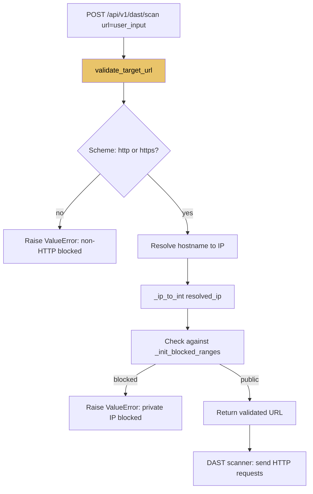

# PRD: Community 505 — dast_engine.validate_target_url

## Master Goal Mapping
**ALDECI Pillar**: DAST — SSRF Prevention (URL Validation)  
**Persona**: Security Engineer, AppSec  
**Business Value**: Validates DAST scan target URLs to prevent Server-Side Request Forgery attacks where an adversary provides an internal URL (e.g., `http://169.254.169.254/latest/meta-data/`) to steal cloud credentials via the DAST scanner.

## Architecture Diagram


## Code Proof
**File**: `suite-core/core/dast_engine.py`  
```python
def validate_target_url(url: str) -> str:
    """Validate target URL to prevent SSRF attacks.
    Blocks: Non HTTP/HTTPS schemes, private IPs, loopback, cloud metadata."""
    parsed = urlparse(url)
    if parsed.scheme not in ("http", "https"):
        raise ValueError(f"Invalid scheme {parsed.scheme!r}: only http/https allowed")
    hostname = parsed.hostname
    if not hostname:
        raise ValueError("URL has no hostname")
    try:
        ip = socket.gethostbyname(hostname)
        ip_int = _ip_to_int(ip)
        for low, high in _init_blocked_ranges():
            if low <= ip_int <= high:
                raise ValueError(f"Target IP {ip} is in a blocked private range")
    except socket.gaierror:
        raise ValueError(f"Cannot resolve hostname: {hostname}")
    return url
```

## Inter-Dependencies
- **Upstream**: DAST scan API endpoint, spider/crawler
- **Downstream**: `httpx.AsyncClient.get(validated_url)` — safe HTTP request
- **Sibling**: `_ip_to_int` (503), `_init_blocked_ranges` (504), `security_hardening.validate_url` (515)

## Data Flow
```
POST /api/v1/dast/scan {"target": "http://169.254.169.254/latest/meta-data/"}
  → validate_target_url("http://169.254.169.254/latest/meta-data/")
    → scheme=http ✓
    → resolve: 169.254.169.254 → ip_int = 2851995902
    → check range: (2851995648, 2852061183) [169.254.0.0/16] → BLOCKED
    → raise ValueError("Target IP is in a blocked private range")
  → 422 Unprocessable Entity
```

## Referenced Docs
- `suite-core/core/dast_engine.py`
- CWE-918: SSRF, OWASP SSRF Prevention Cheat Sheet

## Acceptance Criteria
- [ ] Blocks `file://`, `ftp://`, `gopher://` schemes
- [ ] Blocks 10.x.x.x, 172.16-31.x.x, 192.168.x.x
- [ ] Blocks 127.x.x.x and 169.254.169.254 (AWS metadata)
- [ ] Accepts public IPs and valid domain names
- [ ] Raises ValueError (not 500) on any rejection
- [ ] DNS resolution performed before range check (hostname → IP)

## Effort Estimate
**S** — 1 day. Implementation complete; security-focused integration tests with mock DNS.

## Status
**COMPLETE** — Implementation exists. Mock-DNS security tests needed.
