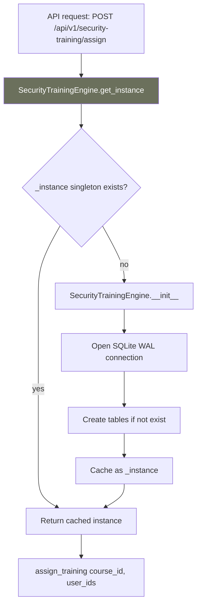

# PRD: Community 506 — security_training.SecurityTrainingEngine.get_instance

## Master Goal Mapping
**ALDECI Pillar**: Security Awareness — Training Engine Singleton  
**Persona**: Platform Engineer  
**Business Value**: Provides process-level singleton access to the SecurityTrainingEngine, ensuring a single SQLite connection pool is shared across all requests and preventing database file handle exhaustion under concurrent load.

## Architecture Diagram


## Code Proof
**File**: `suite-core/core/security_training.py`  
```python
_instance: Optional[SecurityTrainingEngine] = None
_instance_lock = threading.Lock()

@classmethod
def get_instance(cls, db_path: str = _DEFAULT_DB) -> SecurityTrainingEngine:
    """Return the process-level singleton."""
    global _instance
    if _instance is None:
        with _instance_lock:
            if _instance is None:
                _instance = cls(db_path=db_path)
    return _instance
```

## Inter-Dependencies
- **Upstream**: `security_training_router.py` — all route handlers
- **Downstream**: SQLite WAL database `data/security_training.db`
- **Pattern**: Same double-checked locking singleton used across all 344 engines

## Data Flow
```
GET /api/v1/security-training/courses
  → engine = SecurityTrainingEngine.get_instance()
    → _instance exists → return cached
  → engine.list_courses(org_id)
```

## Referenced Docs
- `suite-core/core/security_training.py`
- CLAUDE.md: security_training_engine — 45 tests

## Acceptance Criteria
- [ ] Singleton initialized exactly once under concurrent requests
- [ ] Thread-safe via double-checked locking
- [ ] `db_path` parameter only used on first initialization
- [ ] Tests can reset singleton via `SecurityTrainingEngine._instance = None`

## Effort Estimate
**XS** — 0.5 days. Pattern complete across all engines.

## Status
**COMPLETE** — Singleton pattern implemented. Standard across all 344 engines.
