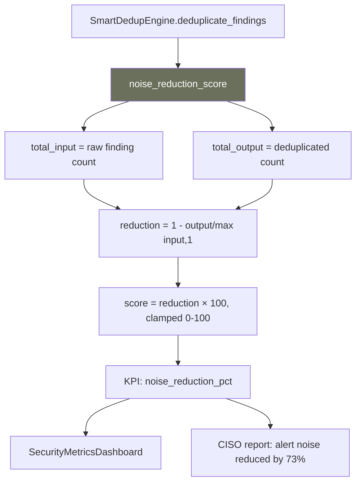

# PRD: Community 507 — smart_dedup.noise_reduction_score

## Master Goal Mapping
**ALDECI Pillar**: ASPM — Alert Deduplication Quality  
**Persona**: SOC Analyst, Security Engineer  
**Business Value**: Computes a 0-100 noise reduction score representing how much duplicate alert volume was suppressed, giving analysts a measurable KPI for deduplication effectiveness and enabling SLA reporting on alert noise reduction.

## Architecture Diagram


## Code Proof
**File**: `suite-core/core/smart_dedup.py`  
```python
def noise_reduction_score(total_input: int, total_output: int) -> float:
    """Score 0-100 representing how much noise was reduced.
    0 = no reduction, 100 = everything deduplicated."""
    if total_input <= 0:
        return 0.0
    reduction = 1.0 - (total_output / total_input)
    return round(max(0.0, min(100.0, reduction * 100)), 2)
```

## Inter-Dependencies
- **Upstream**: `SmartDedupEngine.deduplicate_findings(findings)` → returns deduplicated list
- **Downstream**: `SecurityKPITracker` (MTTD/MTTR/noise KPIs), CISO report
- **Sibling**: Finding hash-based dedup, fuzzy similarity dedup

## Data Flow
```
raw_findings = fetch_all_findings(org_id)  # 500 findings
deduped = engine.deduplicate(raw_findings)  # 135 unique
score = noise_reduction_score(500, 135) = (1 - 135/500) × 100 = 73.0
→ KPI: alert_noise_reduction = 73.0%
```

## Referenced Docs
- `suite-core/core/smart_dedup.py`
- ALDECI Security KPI Tracker engine

## Acceptance Criteria
- [ ] input=0 → 0.0 (no division by zero)
- [ ] input=100, output=100 → 0.0 (no reduction)
- [ ] input=100, output=0 → 100.0 (perfect dedup)
- [ ] input=500, output=135 → 73.0
- [ ] Score clamped [0.0, 100.0]
- [ ] Returns float rounded to 2 decimal places

## Effort Estimate
**XS** — 0.5 days. Function complete; add boundary tests.

## Status
**COMPLETE** — Implementation exists. Boundary tests needed.
