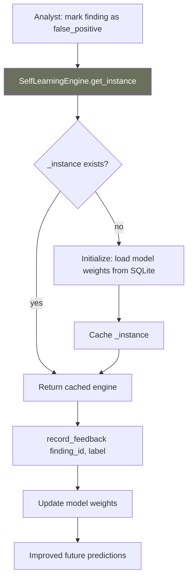

# PRD: Community 508 — self_learning.SelfLearningEngine.get_instance

## Master Goal Mapping
**ALDECI Pillar**: AI — Self-Learning Engine Singleton  
**Persona**: Platform Engineer  
**Business Value**: Thread-safe singleton accessor for the SelfLearningEngine, which accumulates analyst feedback to improve CVE prioritization and false positive suppression over time — ensuring all feedback goes to the same model instance.

## Architecture Diagram


## Code Proof
**File**: `suite-core/core/self_learning.py`  
```python
@classmethod
def get_instance(cls) -> SelfLearningEngine:
    """Thread-safe singleton accessor."""
    global _instance
    if _instance is None:
        with _instance_lock:
            if _instance is None:
                _instance = cls()
    return _instance
```

## Inter-Dependencies
- **Upstream**: Any engine that records analyst feedback
- **Downstream**: CTEM priority scoring, false positive suppression
- **Sibling**: Same double-checked singleton pattern as all 344 engines

## Data Flow
```
Analyst clicks "False Positive" on finding F-123
  → SelfLearningEngine.get_instance().record_feedback("F-123", "false_positive")
    → update sqlite: feedback_log
    → retrain lightweight model (logistic regression / feature weights)
  → Next scan: F-123 type deprioritized
```

## Referenced Docs
- `suite-core/core/self_learning.py`

## Acceptance Criteria
- [ ] Singleton initialized once under concurrent access
- [ ] Model weights persisted to SQLite between restarts
- [ ] `record_feedback` updates weights atomically
- [ ] Singleton resettable in tests

## Effort Estimate
**XS** — 0.5 days. Singleton pattern complete; verify weight persistence.

## Status
**COMPLETE** — Singleton pattern implemented.
