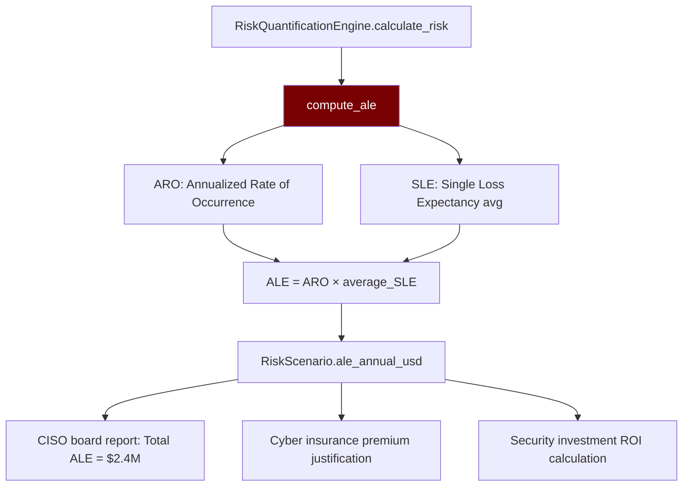

# PRD: Community 509 — risk_quantification_engine.compute_ale

## Master Goal Mapping
**ALDECI Pillar**: Risk Management — FAIR Risk Quantification  
**Persona**: CISO, Risk Manager  
**Business Value**: Computes Annualized Loss Expectancy (ALE = ARO × SLE) using the FAIR methodology, converting qualitative risk ratings to dollar figures for board-level risk reporting and cyber insurance premium calculations.

## Architecture Diagram


## Code Proof
**File**: `suite-core/core/risk_quantification_engine.py`  
```python
def compute_ale(probability: float, average_single_loss_expectancy: float) -> float:
    """Annualized Loss Expectancy = probability × average single loss expectancy."""
    return probability * average_single_loss_expectancy
```

## Inter-Dependencies
- **Upstream**: `RiskQuantificationEngine.calculate_risk(scenario)` — provides ARO and SLE
- **Downstream**: `RiskScenario.ale_annual_usd`, portfolio ALE aggregation, CISO reports
- **Sibling**: `risk_quantification_engine_v2.py` (FAIR v2 — Community Wave 39)

## Data Flow
```
scenario = RiskScenario(
    name="Ransomware on prod DB",
    probability=0.15,  # 15% annual chance
    single_loss_min=500_000, single_loss_max=2_000_000
)
average_sle = (500_000 + 2_000_000) / 2 = 1_250_000
ale = compute_ale(0.15, 1_250_000) = $187,500/year
→ RiskScenario.ale_annual_usd = 187500
```

## Referenced Docs
- `suite-core/core/risk_quantification_engine.py`
- FAIR (Factor Analysis of Information Risk) methodology
- ALDECI DONE: risk_quantification_engine_v2 — 47 tests (FAIR v2)

## Acceptance Criteria
- [ ] ALE = probability × average_SLE (exact multiplication)
- [ ] probability=0 → ALE=0
- [ ] probability=1.0 → ALE=average_SLE
- [ ] Returns float (not integer truncation)
- [ ] Used in board-level risk portfolio report

## Effort Estimate
**XS** — 0.5 days. Function complete; integrate with FAIR v2 engine.

## Status
**COMPLETE** — Basic FAIR implementation. FAIR v2 (Wave 39) is the production engine.
