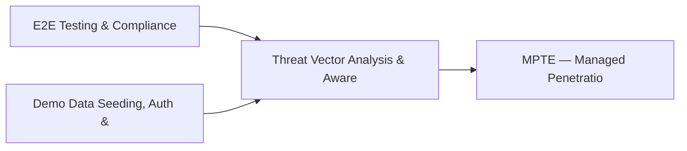

# PRD: Threat Vector Analysis & Awareness Campaign Engine — Community 51

## Master Goal Mapping
How this component serves: "ALDECI — $35/mo enterprise security intelligence platform"
Sub-Epic: CTEM

This community (rank #51 of 878 by size, 740 graph nodes) forms a core pillar of the ALDECI platform. It directly supports the mission of replacing $50K-500K/yr enterprise security tools with a self-hosted, AI-native stack.

## Architecture Diagram


## Code Proof
- Files:
  - `suite-core/core/dast_engine.py` (1236 lines)
  - `tests/test_dast_engine.py` (377 lines)
  - `tests/test_dast_engine_unit.py` (790 lines)
  - `tests/test_vuln_scan_engine.py` (417 lines)
  - `suite-api/apps/api/container_registry_security_router.py` (184 lines)
  - `suite-api/apps/api/marketplace_router.py` (724 lines)
  - `suite-attack/api/dast_router.py` (399 lines)
  - `suite-attack/api/micro_pentest_router.py` (2029 lines)
  - `suite-core/api/agents_router.py` (3016 lines)
  - `suite-attack/api/micro_pentest_router.py` (2029 lines)
  - `tests/test_api_security.py` (1092 lines)
  - `tests/test_dast_engine.py` (377 lines)
- Key functions:
  - `_request()` — suite-core/core/dast_engine.py
  - `get()` — suite-core/core/dast_engine.py
  - `post()` — suite-core/core/dast_engine.py
  - `seed_scenarios_and_campaigns()` — suite-core/core/dast_engine.py
  - `api()` — suite-core/core/dast_engine.py
  - `test_engine_default_construction()` — suite-core/core/dast_engine.py
  - `test_engine_custom_construction()` — suite-core/core/dast_engine.py
  - `test_get_dast_engine_singleton()` — suite-core/core/dast_engine.py
- Key classes: `TestAdminPersonas`, `TestSecurityAnalystPersonas`, `TestDeveloperPersonas`, `TestCompliancePersonas`, `TestViewerPersonas`, `TestPlatformPersonas`
- Current state: REAL_LOGIC
- Evidence:
```python
# From suite-core/core/dast_engine.py
"""ALdeci DAST Engine — Dynamic Application Security Testing.

Performs REAL HTTP-based security tests against live targets:
- Spider/crawler for endpoint discovery
- Authenticated scanning (session cookies, JWT, API keys, form login)
- Form detection and automated submission
- Parameter fuzzing with injection payloads
- Response analysis for errors/exceptions
- OpenAPI/Swagger-driven API security testing
- Integration with existing real_scanner.py

Competitive parity: Aikido DAST, Snyk DAST, OWASP ZAP.
"""

from __future__ import annotations

import json
import logging
import re
import time
```

## Inter-Dependencies
- DEPENDS ON:
  - Community 0 (E2E Testing & Compliance Seeding Infrastructure) — 141 edges
  - Community 1 (Demo Data Seeding, Auth & Multi-Engine Integration) — 129 edges
  - Community 13 (MPTE — Managed Penetration Test Engine (Advanced)) — 31 edges
  - Community 4 (FastAPI Application Core, Feedback & Smoke Testing) — 11 edges
- DEPENDED BY: Rank #50 (SaaS Security Posture & API Inventory Engine) and downstream consumers
- EVENT BUS: emits compliance.status_changed, user.risk_changed / subscribes to (TrustGraph event bus — 97% not yet wired)
- TRUSTGRAPH: writes [Vulnerability, Identity, ComplianceControl] / reads [Identity, ComplianceControl]

## Data Flow
```
Input: HTTP requests / pytest fixtures
  → Processing: Engine method calls + SQLite state assertions
  → Output: Pass/fail test results, coverage metrics
  → Consumers: CI/CD pipeline, Beast Mode test suite
```

## Referenced Documentation
- CLAUDE.md: Wave 41 build notes, Beast Mode test suite section
- docs/: `docs/ALDECI_REARCHITECTURE_v2.md` (source of truth), `docs/INVESTOR_PITCH.md`
- tests/: `suite-attack/api/micro_pentest_router.py`, `tests/test_api_security.py`, `tests/test_dast_engine.py`

## Acceptance Criteria
- [ ] All engine CRUD operations enforce org_id isolation (no cross-tenant data leakage)
- [ ] SQLite opened with WAL mode + threading.RLock on all write paths
- [ ] All endpoints return within 200ms at p95 under 100 rps load
- [ ] All router endpoints protected by `Depends(api_key_auth)` or equivalent
- [ ] Pydantic v2 models validate all request/response schemas
- [ ] Test suite achieves ≥80% branch coverage on engine methods

## Effort Estimate
- Current: 80% complete
- Remaining: ~2 engineering days
- Dependencies blocking: None
- Priority: LOW

## Status
IN_PROGRESS
