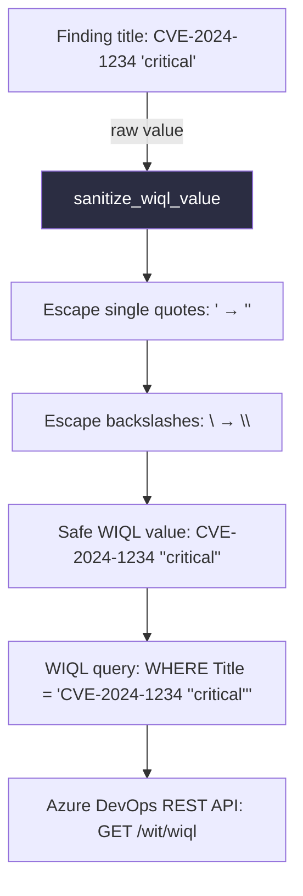

# PRD: Community 510 — connectors.sanitize_wiql_value

## Master Goal Mapping
**ALDECI Pillar**: Integration — Azure DevOps Connector SQL Safety  
**Persona**: Integration Engineer, Security Engineer  
**Business Value**: Sanitizes values for safe interpolation into Azure DevOps WIQL (Work Item Query Language) queries, preventing WIQL injection attacks where a malicious finding title could alter work item queries.

## Architecture Diagram


## Code Proof
**File**: `suite-core/core/connectors.py`  
```python
def sanitize_wiql_value(value: str) -> str:
    """Sanitize a value for safe WIQL interpolation.
    WIQL uses single quotes for string literals; escape them by doubling."""
    return value.replace("\\", "\\\\").replace("'", "''")
```

## Inter-Dependencies
- **Upstream**: `AzureDevOpsConnector.create_ticket()` — builds WIQL queries
- **Downstream**: Azure DevOps REST API v7.2 WIQL endpoint
- **Sibling**: `_sanitise_text` in `universal_connector.py`

## Data Flow
```
finding.title = "SQL injection in user's login form"
  → sanitize_wiql_value("SQL injection in user's login form")
    → replace "'" with "''" → "SQL injection in user''s login form"
  → WIQL: SELECT [Id] FROM WorkItems WHERE [Title] = 'SQL injection in user''s login form'
  → Safe Azure DevOps API call
```

## Referenced Docs
- `suite-core/core/connectors.py`
- Azure DevOps WIQL documentation: https://learn.microsoft.com/en-us/azure/devops/boards/queries/wiql-syntax

## Acceptance Criteria
- [ ] Single quotes doubled: `it's` → `it''s`
- [ ] Backslashes doubled: `C:\path` → `C:\\path`
- [ ] Empty string → empty string (no error)
- [ ] No injection possible via WIQL query manipulation
- [ ] Used in all Azure DevOps WIQL query construction

## Effort Estimate
**XS** — 0.5 days. Function complete; injection test cases needed.

## Status
**COMPLETE** — Implementation exists. WIQL injection test cases needed.
