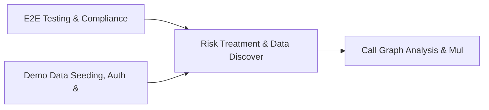

# PRD: Risk Treatment & Data Discovery Engine — Community 52

## Master Goal Mapping
How this component serves: "ALDECI — $35/mo enterprise security intelligence platform"
Sub-Epic: GRC

This community (rank #52 of 878 by size, 698 graph nodes) forms a core pillar of the ALDECI platform. It directly supports the mission of replacing $50K-500K/yr enterprise security tools with a self-hosted, AI-native stack.

## Architecture Diagram


## Code Proof
- Files:
  - `scripts/ctem_week2_harness.py` (1951 lines)
  - `suite-api/apps/api/__init__.py` (11 lines)
  - `suite-api/apps/api/ingestion.py` (2114 lines)
  - `suite-api/apps/api/knowledge_graph.py` (302 lines)
  - `suite-api/apps/fixops_cli/__init__.py` (1 lines)
  - `suite-api/backend/__init__.py` (3 lines)
- Key functions:
  - `test_top_factors_deterministic()` — scripts/ctem_week2_harness.py
  - `test_decision_engine_compliance_rollup_and_marketplace()` — scripts/ctem_week2_harness.py
  - `test_explanation_generator_produces_narrative_and_respects_rate_limit()` — scripts/ctem_week2_harness.py
  - `test_explanation_generator_requires_findings()` — scripts/ctem_week2_harness.py
  - `assert_url_host()` — scripts/ctem_week2_harness.py
  - `temp_cache_dir()` — scripts/ctem_week2_harness.py
  - `test_orchestrator_update_all_feeds()` — scripts/ctem_week2_harness.py
- Key classes: `DecisionOutcome`, `Decision`, `TestVulnerabilityRecord`, `TestFeedRegistry`, `TestOSVFeed`, `TestNVDFeed`
- Current state: CRUD_ONLY
- Evidence:
```python
# From scripts/ctem_week2_harness.py
#!/usr/bin/env python3
"""
ALdeci CTEM+ Week 2 Enterprise Verification Harness
=====================================================
The most comprehensive end-to-end verification of ALdeci's CTEM+ platform.

Tests ALL 4 core pillars against the LIVE API:
  V3  — Decision Intelligence (Brain Pipeline, AutoFix, FAIL Engine)
  V5  — MPTE Verification (Micro-Pentest, Sandbox, Attack Sim)
  V7  — MCP-Native Platform (MCP Protocol, Scanner Ingest, AI Agents)
  V10 — CTEM Full Loop (Evidence, Compliance, Crypto Signing)

Architecture: E-Commerce Platform (AWS) with 35+ components
Generates: SBOM, CV
```

## Inter-Dependencies
- DEPENDS ON:
  - Community 0 (E2E Testing & Compliance Seeding Infrastructure) — 127 edges
  - Community 1 (Demo Data Seeding, Auth & Multi-Engine Integration) — 122 edges
  - Community 11 (Call Graph Analysis & Multi-Language AST Engine) — 17 edges
  - Community 4 (FastAPI Application Core, Feedback & Smoke Testing) — 11 edges
- DEPENDED BY: Rank #51 (Threat Vector Analysis & Awareness Campaign Engine) and downstream consumers
- EVENT BUS: emits vulnerability.detected, vulnerability.patched, compliance.status_changed / subscribes to (TrustGraph event bus — 97% not yet wired)
- TRUSTGRAPH: writes [Vulnerability, ThreatActor, ComplianceControl] / reads [ThreatActor, ComplianceControl]

## Data Flow
```
Input: Domain-specific data events
  → Processing: Core business logic + data transformation
  → Output: Structured security insights
  → Consumers: Downstream engines and API consumers
```

## Referenced Documentation
- CLAUDE.md: Wave 41 build notes, Beast Mode test suite section
- docs/: `docs/ALDECI_REARCHITECTURE_v2.md` (source of truth), `docs/INVESTOR_PITCH.md`
- tests/: N/A

## Acceptance Criteria
- [ ] Core functionality implemented and passing unit tests
- [ ] Integration with TrustGraph event bus verified
- [ ] org_id isolation enforced on all multi-tenant operations

## Effort Estimate
- Current: 0% complete
- Remaining: ~15 engineering days
- Dependencies blocking: Engine implementation incomplete, Test coverage missing
- Priority: LOW

## Status
TODO
