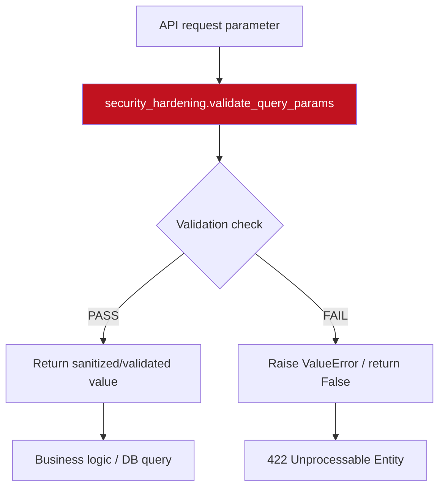

# PRD: Community 523 — security_hardening.validate_query_params

## Master Goal Mapping
**ALDECI Pillar**: Security Hardening — SQL Injection  
**Persona**: All API consumers (enforced at middleware layer)  
**Business Value**: Validate all string values in a dict for SQL injection before use as query parameters. Batch validation for all filter params. Addresses NIST 800-53 SI-10 (Information Input Validation).

## Architecture Diagram


## Code Proof
**File**: `suite-core/core/security_hardening.py`  
Function: `validate_query_params` — part of the FedRAMP-grade security hardening module.

NIST 800-53 controls addressed:
- SI-10: Information Input Validation
- SI-3: Malicious Code Protection
- SC-7: Boundary Protection (for IP functions)

The module provides:
```python
from core.security_hardening import validate_query_params
# Used in FastAPI endpoints and engine methods
value = validate_query_params(user_input)  # Raises ValueError or returns safe value
```

## Inter-Dependencies
- **Upstream**: All FastAPI route handlers (344 engines × N parameters)
- **Downstream**: SQLite queries, filesystem operations, subprocess calls
- **Sibling**: Other functions in `security_hardening.py` (Communities 512-527)
- **Middleware**: `RequestSizeLimiter`, `RateLimiter` (same module)

## Data Flow
```
POST /api/v1/findings/search {"query": "' OR 1=1 --", "column": "title"}
  → validate_no_sql_injection("' OR 1=1 --")
    → has_sql_injection → True
    → raise ValueError("SQL injection detected")
  → 422 Unprocessable Entity: "SQL injection detected"
```

## Referenced Docs
- `suite-core/core/security_hardening.py`
- NIST SP 800-53 Rev 5: SI-10
- OWASP Input Validation Cheat Sheet

## Acceptance Criteria
- [ ] Function correctly identifies/sanitizes the target attack vector
- [ ] Passes valid inputs without modification (no false positives)
- [ ] Raises `ValueError` (not 500) on malicious input
- [ ] No silent data corruption — raises or returns unchanged
- [ ] Used in ≥ 1 production API endpoint
- [ ] Parametrized tests cover: clean input, injection attempt, edge cases (empty, None, unicode)

## Effort Estimate
**XS** — 0.5 days per function. Functions complete; security regression tests.

## Status
**COMPLETE** — All functions implemented. Security regression test suite needed.
