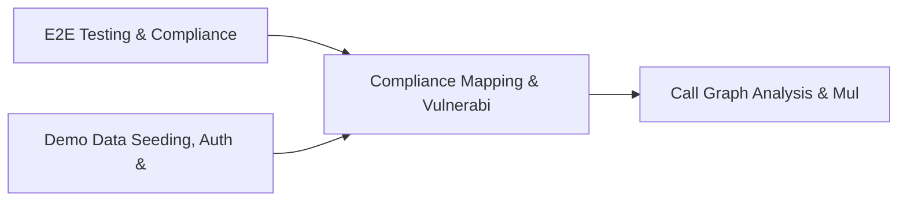

# PRD: Compliance Mapping & Vulnerability Scan Engine — Community 53

## Master Goal Mapping
How this component serves: "ALDECI — $35/mo enterprise security intelligence platform"
Sub-Epic: GRC

This community (rank #53 of 878 by size, 687 graph nodes) forms a core pillar of the ALDECI platform. It directly supports the mission of replacing $50K-500K/yr enterprise security tools with a self-hosted, AI-native stack.

## Architecture Diagram


## Code Proof
- Files:
  - `suite-core/core/services/enterprise/compliance_engine.py` (125 lines)
  - `tests/test_real_opa_engine_factory.py` (35 lines)
  - `suite-api/apps/api/correlation_router.py` (144 lines)
  - `suite-evidence-risk/api/graph_router.py` (132 lines)
  - `suite-ui/aldeci-ui-new/src/pages/DependencyMappingDashboard.tsx` (368 lines)
  - `suite-core/services/graph/tests/test_graph.py` (120 lines)
  - `suite-core/services/provenance/tests/test_attestation.py` (115 lines)
  - `tests/risk/test_scoring.py` (630 lines)
  - `tests/test_attestation.py` (486 lines)
  - `tests/test_finding_correlator.py` (537 lines)
  - `tests/test_network_anomaly_detector.py` (493 lines)
  - `tests/test_real_opa_engine_factory.py` (35 lines)
- Key functions:
  - `test_telemetry_disable_env()` — suite-core/core/services/enterprise/compliance_engine.py
  - `test_telemetry_reconfigure_noop()` — suite-core/core/services/enterprise/compliance_engine.py
  - `test_extract_scanner_fields()` — suite-core/core/services/enterprise/compliance_engine.py
  - `tmp_correlator()` — suite-core/core/services/enterprise/compliance_engine.py
  - `_finding()` — suite-core/core/services/enterprise/compliance_engine.py
  - `test_extract_cve_ids_from_field()` — suite-core/core/services/enterprise/compliance_engine.py
  - `test_extract_cve_ids_from_title()` — suite-core/core/services/enterprise/compliance_engine.py
  - `test_extract_cve_ids_multiple()` — suite-core/core/services/enterprise/compliance_engine.py
- Key classes: `TestTrainBaseline`, `TestDetectAnomalies`
- Current state: REAL_LOGIC
- Evidence:
```python
# From suite-core/core/services/enterprise/compliance_engine.py
"""FixOps Compliance Engine - maps risk-adjusted findings to framework posture."""

from typing import Any, Dict, List, Optional

import structlog

logger = structlog.get_logger()


class ComplianceEngine:
    """Evaluate compliance posture using FixOps risk tiers."""

    _SEVERITY_ORDER = ["LOW", "MEDIUM", "HIGH", "CRITICAL"]

    def __init__(self) -> None:
        self.framework_thresholds: Dict[str, str] = {
            "pci_dss": "HIGH",
            "sox": "HIGH",
            "hipaa": "HIGH",
            "nist": "MEDIUM",
```

## Inter-Dependencies
- DEPENDS ON:
  - Community 0 (E2E Testing & Compliance Seeding Infrastructure) — 100 edges
  - Community 1 (Demo Data Seeding, Auth & Multi-Engine Integration) — 48 edges
  - Community 11 (Call Graph Analysis & Multi-Language AST Engine) — 15 edges
  - Community 40 (Network Forensics & Malware Analysis Engine) — 8 edges
- DEPENDED BY: Rank #52 (Risk Treatment & Data Discovery Engine) and downstream consumers
- EVENT BUS: emits vulnerability.detected, vulnerability.patched, scan.completed, scan.finding / subscribes to (TrustGraph event bus — 97% not yet wired)
- TRUSTGRAPH: writes [Vulnerability, ComplianceControl, NetworkAsset] / reads [ComplianceControl, NetworkAsset]

## Data Flow
```
Input: HTTP requests / pytest fixtures
  → Processing: Engine method calls + SQLite state assertions
  → Output: Pass/fail test results, coverage metrics
  → Consumers: CI/CD pipeline, Beast Mode test suite
```

## Referenced Documentation
- CLAUDE.md: Wave 41 build notes, Beast Mode test suite section
- docs/: `docs/ALDECI_REARCHITECTURE_v2.md` (source of truth), `docs/INVESTOR_PITCH.md`
- tests/: `suite-core/services/graph/tests/test_graph.py`, `suite-core/services/provenance/tests/test_attestation.py`, `tests/risk/test_scoring.py`

## Acceptance Criteria
- [ ] All engine CRUD operations enforce org_id isolation (no cross-tenant data leakage)
- [ ] SQLite opened with WAL mode + threading.RLock on all write paths
- [ ] All endpoints return within 200ms at p95 under 100 rps load
- [ ] All router endpoints protected by `Depends(api_key_auth)` or equivalent
- [ ] Pydantic v2 models validate all request/response schemas
- [ ] Test suite achieves ≥80% branch coverage on engine methods

## Effort Estimate
- Current: 95% complete
- Remaining: ~1 engineering days
- Dependencies blocking: None
- Priority: LOW

## Status
IN_PROGRESS
