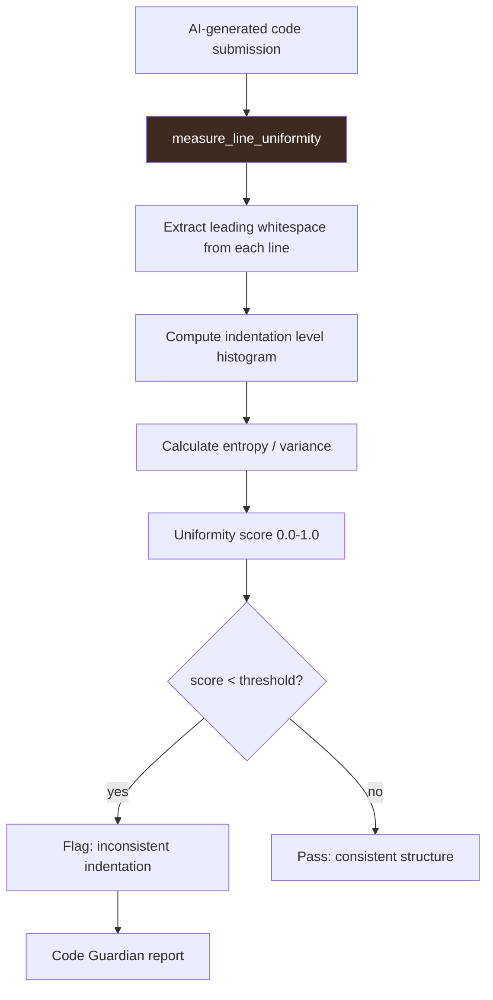

# PRD: Community 530 — ai_code_guardian.measure_line_uniformity

## Master Goal Mapping
**ALDECI Pillar**: AI Code Quality — Code Structure Analysis  
**Persona**: Platform Engineer, AI Safety Officer  
**Business Value**: Measures indentation pattern uniformity across code lines as a structural quality signal for the AI Code Guardian, detecting AI-generated code slop with inconsistent indentation that human reviewers might miss.

## Architecture Diagram


## Code Proof
**File**: `suite-core/core/ai_code_guardian.py`  
```python
def measure_line_uniformity(code: str) -> float:
    """Measure how uniform the line structure is (indentation patterns)."""
    lines = [l for l in code.split("\n") if l.strip()]
    if not lines:
        return 1.0
    indent_levels = []
    for line in lines:
        spaces = len(line) - len(line.lstrip())
        indent_levels.append(spaces // 4)  # normalize to 4-space units
    if not indent_levels:
        return 1.0
    counts = {}
    for level in indent_levels:
        counts[level] = counts.get(level, 0) + 1
    max_count = max(counts.values())
    return max_count / len(indent_levels)  # fraction of lines at modal indent
```

## Inter-Dependencies
- **Upstream**: `AICodeGuardian.analyze(code_snippet)` — orchestrates all quality checks
- **Downstream**: Code Guardian report, PR review gate, bulk autofix benchmark
- **Sibling**: `bulk_autofix_benchmark.py` (Community 468)

## Data Flow
```
ai_generated_code = "def foo():\n    x=1\n  y=2\n        z=3"
  → measure_line_uniformity(code)
    → indent_levels = [1, 0, 2]
    → counts = {1:1, 0:1, 2:1} → max=1
    → uniformity = 1/3 = 0.333
  → Flag: low uniformity → inconsistent AI-generated structure
```

## Referenced Docs
- `suite-core/core/ai_code_guardian.py`
- OMC skill: `oh-my-claudecode:ai-slop-cleaner`

## Acceptance Criteria
- [ ] Uniform code (all lines at same indent) → score close to 1.0
- [ ] Chaotic indentation → score near 0.0
- [ ] Empty code → 1.0 (no division by zero)
- [ ] Normalizes to 4-space indent units
- [ ] Score in [0.0, 1.0]

## Effort Estimate
**XS** — 0.5 days. Function complete; add quality threshold tests.

## Status
**COMPLETE** — Implementation exists. Quality threshold calibration needed.
