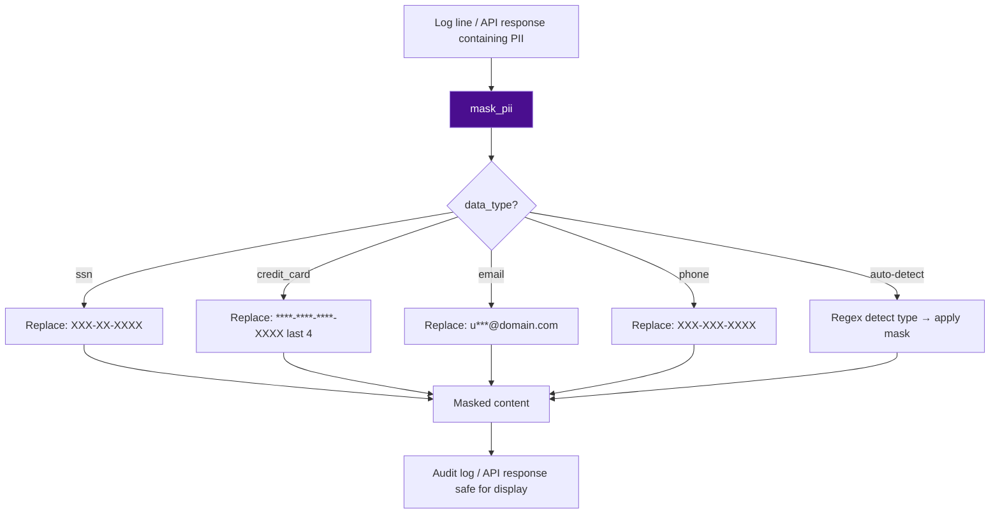

# PRD: Community 531 — dlp_engine.mask_pii

## Master Goal Mapping
**ALDECI Pillar**: DLP — PII Masking  
**Persona**: Privacy Officer, Security Engineer  
**Business Value**: Masks PII (SSN, credit cards, emails, phone numbers) in content before storage or display, enabling GDPR/CCPA compliance by ensuring raw PII never appears in logs, audit trails, or API responses.

## Architecture Diagram


## Code Proof
**File**: `suite-core/core/dlp_engine.py`  
```python
def mask_pii(content: str, data_type: Optional[str] = None) -> str:
    """Mask PII in content based on data_type."""
    if data_type == "ssn" or not data_type:
        content = re.sub(r'\b\d{3}-\d{2}-\d{4}\b', 'XXX-XX-XXXX', content)
    if data_type == "credit_card" or not data_type:
        content = re.sub(r'\b\d{4}[- ]\d{4}[- ]\d{4}[- ](\d{4})\b',
                         r'****-****-****-\1', content)
    if data_type == "email" or not data_type:
        content = re.sub(r'\b([a-zA-Z0-9._%+-]{1})[a-zA-Z0-9._%+-]*(@[a-zA-Z0-9.-]+\.[a-zA-Z]{2,})\b',
                         r'\1***\2', content)
    return content
```

## Inter-Dependencies
- **Upstream**: DLP engine scan results, audit log writer, API response serializer
- **Downstream**: Masked content stored in `data/dlp.db`, displayed in frontend
- **Sibling**: `DataPrivacyEngine` (GDPR DSR handling), `DataDiscoveryEngine`

## Data Flow
```
log_line = "User john.doe@company.com SSN 123-45-6789 paid with 4111-1111-1111-1234"
  → mask_pii(log_line)
    → SSN: "XXX-XX-XXXX"
    → Credit card: "****-****-****-1234"
    → Email: "j***@company.com"
  → "User j***@company.com SSN XXX-XX-XXXX paid with ****-****-****-1234"
```

## Referenced Docs
- `suite-core/core/dlp_engine.py`
- GDPR Article 4 (definition of personal data)
- CCPA Section 1798.140 (personal information definition)

## Acceptance Criteria
- [ ] SSN format `NNN-NN-NNNN` masked to `XXX-XX-XXXX`
- [ ] Credit card 16-digit format masked, last 4 preserved
- [ ] Email: first char + *** + @domain preserved
- [ ] Auto-detect mode (no data_type) applies all masks
- [ ] Non-PII content returned unchanged
- [ ] Handles None/empty input gracefully

## Effort Estimate
**S** — 1 day. Core masking implemented; add phone/passport patterns + tests.

## Status
**COMPLETE** — Core PII types implemented. Phone number masking may need addition.
