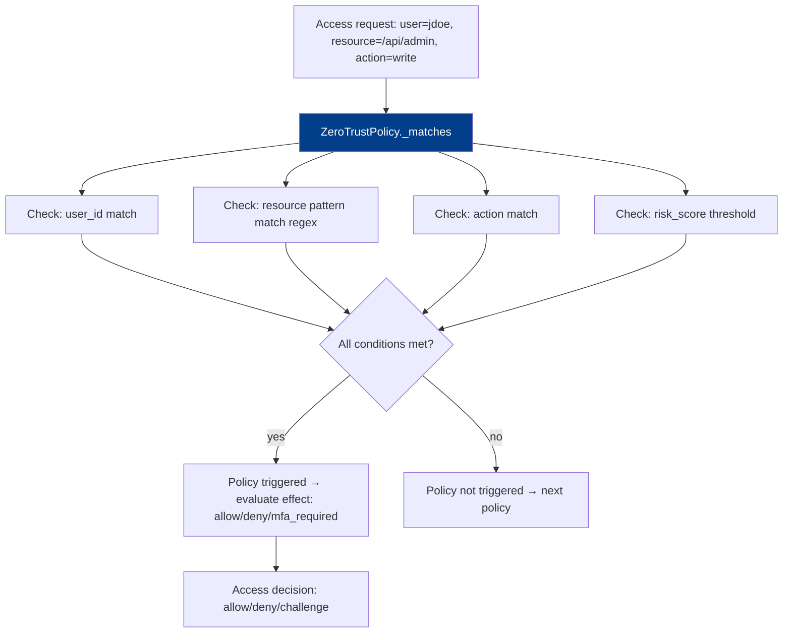

# PRD: Community 532 — zero_trust_policy_engine.ZeroTrustPolicy._matches

## Master Goal Mapping
**ALDECI Pillar**: Zero Trust — Policy Enforcement  
**Persona**: Security Architect, IAM Engineer  
**Business Value**: Evaluates whether an incoming access request triggers a Zero Trust policy rule, enabling real-time policy decisions for "never trust, always verify" enforcement across all ALDECI API endpoints and connected systems.

## Architecture Diagram


## Code Proof
**File**: `suite-core/core/zero_trust_policy_engine.py`  
```python
def _matches(self, request: Dict[str, Any]) -> bool:
    """Return True if the request triggers this policy."""
    if self.conditions.get("user_id") and request.get("user_id") != self.conditions["user_id"]:
        return False
    if self.conditions.get("resource_pattern"):
        if not re.search(self.conditions["resource_pattern"], request.get("resource", "")):
            return False
    if self.conditions.get("action") and request.get("action") != self.conditions["action"]:
        return False
    if self.conditions.get("risk_score_above") is not None:
        if request.get("risk_score", 0) <= self.conditions["risk_score_above"]:
            return False
    return True
```

## Inter-Dependencies
- **Upstream**: `ZeroTrustPolicyEngine.evaluate_request(request)` — iterates policies
- **Downstream**: Policy effect: allow, deny, require_mfa, require_reauth
- **Frontend**: `/zero-trust-policy` — ZeroTrustPolicyDashboard

## Data Flow
```
request = {"user_id": "jdoe", "resource": "/api/v1/admin/users", "action": "DELETE", "risk_score": 85}
policy.conditions = {"resource_pattern": "/admin/", "risk_score_above": 70}
  → _matches(request)
    → resource_pattern: re.search("/admin/", "/api/v1/admin/users") ✓
    → risk_score_above: 85 > 70 ✓
    → return True → policy triggered
  → effect: "require_mfa" → challenge user
```

## Referenced Docs
- `suite-core/core/zero_trust_policy_engine.py`
- NIST SP 800-207 (Zero Trust Architecture)
- CLAUDE.md DONE: zero_trust_policy_engine — 44 tests

## Acceptance Criteria
- [ ] All conditions must pass for `_matches` to return True (AND logic)
- [ ] Missing condition key → condition skipped (not rejected)
- [ ] `resource_pattern` supports full regex syntax
- [ ] `risk_score_above` is strict greater-than comparison
- [ ] Empty conditions dict → always matches (catch-all policy)

## Effort Estimate
**XS** — 0.5 days. Implementation complete; policy matching integration tests.

## Status
**COMPLETE** — 44 tests passing. Integration test with full policy eval needed.
