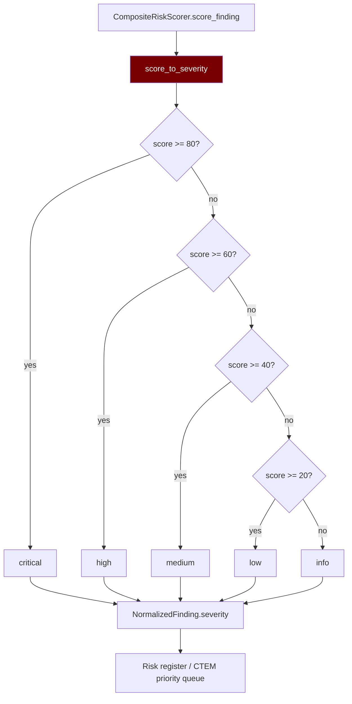

# PRD: Community 533 — composite_risk_scorer.score_to_severity

## Master Goal Mapping
**ALDECI Pillar**: Risk Management — Composite Risk Grading  
**Persona**: Vulnerability Analyst, CISO  
**Business Value**: Maps a 0-100 composite risk score (combining CVSS + EPSS + KEV + exposure) to a human-readable severity grade string (critical/high/medium/low/info), enabling unified severity labeling across all ALDECI risk engines regardless of underlying scoring methodology.

## Architecture Diagram


## Code Proof
**File**: `suite-core/core/composite_risk_scorer.py`  
```python
def score_to_severity(score: float) -> str:
    """Map a 0-100 composite score to a severity grade string."""
    if score >= 80:
        return "critical"
    elif score >= 60:
        return "high"
    elif score >= 40:
        return "medium"
    elif score >= 20:
        return "low"
    return "info"
```

## Inter-Dependencies
- **Upstream**: `CompositeRiskScorer.score_finding(finding)` → composite score 0-100
- **Downstream**: `NormalizedFinding.severity`, CTEM priority queue, risk register
- **Sibling**: `posture_scoring.score_to_grade` (Community 496 — A-F for posture)

## Data Flow
```
finding = {cvss: 7.5, epss: 0.42, kev: True, exposure: 0.8}
  → composite_score = 0.3×75 + 0.25×42 + 0.25×100 + 0.2×80 = 74.0
  → severity = score_to_severity(74.0) = "high"
  → NormalizedFinding.severity = "high"
  → CTEM queue: priority 2 (high)
```

## Referenced Docs
- `suite-core/core/composite_risk_scorer.py`
- FIRST EPSS + CVSS combination methodology

## Acceptance Criteria
- [ ] score=80 → "critical", score=79.9 → "high"
- [ ] score=60 → "high", score=59.9 → "medium"
- [ ] score=40 → "medium", score=39.9 → "low"
- [ ] score=20 → "low", score=19.9 → "info"
- [ ] score=0 → "info", score=100 → "critical"
- [ ] Parametrized boundary tests

## Effort Estimate
**XS** — 0.5 days. Function complete; parametrized boundary tests.

## Status
**COMPLETE** — Implementation exists. Boundary tests needed.
