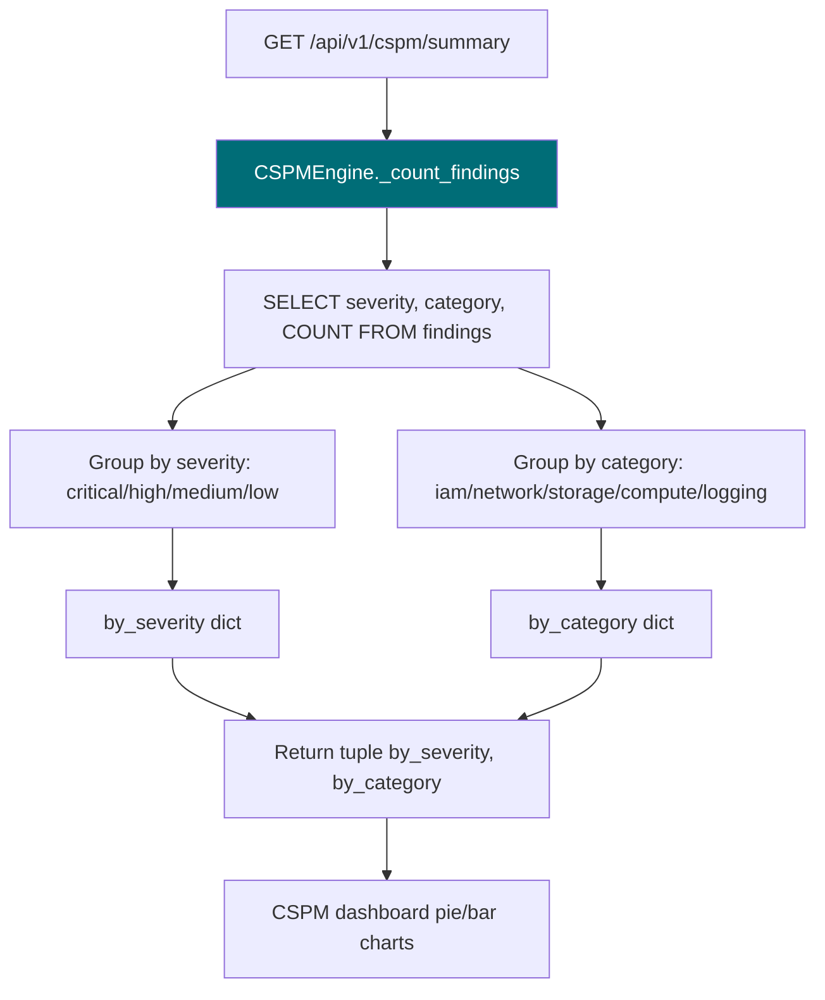

# PRD: Community 534 — cspm_engine.CSPMEngine._count_findings

## Master Goal Mapping
**ALDECI Pillar**: CSPM — Cloud Posture Analytics  
**Persona**: Cloud Security Engineer, CISO  
**Business Value**: Returns aggregated finding counts grouped by severity and category, enabling CSPM dashboards to display breakdown charts without expensive per-request SQL GROUP BY queries on large finding sets.

## Architecture Diagram


## Code Proof
**File**: `suite-core/core/cspm_engine.py`  
```python
def _count_findings(self, org_id: str) -> Tuple[Dict[str, int], Dict[str, int]]:
    """Return (by_severity, by_category) count dicts."""
    with self._get_conn() as conn:
        rows = conn.execute(
            "SELECT severity, category, COUNT(*) as cnt FROM findings "
            "WHERE org_id=? AND status='open' GROUP BY severity, category",
            (org_id,)
        ).fetchall()
    by_severity: Dict[str, int] = {}
    by_category: Dict[str, int] = {}
    for row in rows:
        sev, cat, cnt = row["severity"], row["category"], row["cnt"]
        by_severity[sev] = by_severity.get(sev, 0) + cnt
        by_category[cat] = by_category.get(cat, 0) + cnt
    return by_severity, by_category
```

## Inter-Dependencies
- **Upstream**: CSPM summary endpoint, CSPM dashboard
- **Downstream**: Frontend pie/bar charts, CISO posture report
- **Sibling**: `_compute_posture_score` (Community 535)

## Data Flow
```
GET /api/v1/cspm/summary?org_id=acme
  → engine._count_findings("acme")
    → SQL GROUP BY severity + category
    → by_severity = {"critical": 3, "high": 12, "medium": 45, "low": 89}
    → by_category = {"iam": 23, "network": 38, "storage": 15, "compute": 73}
  → response: {"by_severity": {...}, "by_category": {...}}
```

## Referenced Docs
- `suite-core/core/cspm_engine.py`
- CIS Cloud Security Benchmarks

## Acceptance Criteria
- [ ] Returns tuple (by_severity, by_category)
- [ ] Only counts open findings (status='open')
- [ ] Scoped to org_id (multi-tenant isolation)
- [ ] Empty findings → both dicts empty (no KeyError)
- [ ] SQL uses parameterized query (no injection)

## Effort Estimate
**XS** — 0.5 days. Implementation complete; multi-tenant isolation test needed.

## Status
**COMPLETE** — Implementation exists. Multi-tenant org_id isolation test needed.
