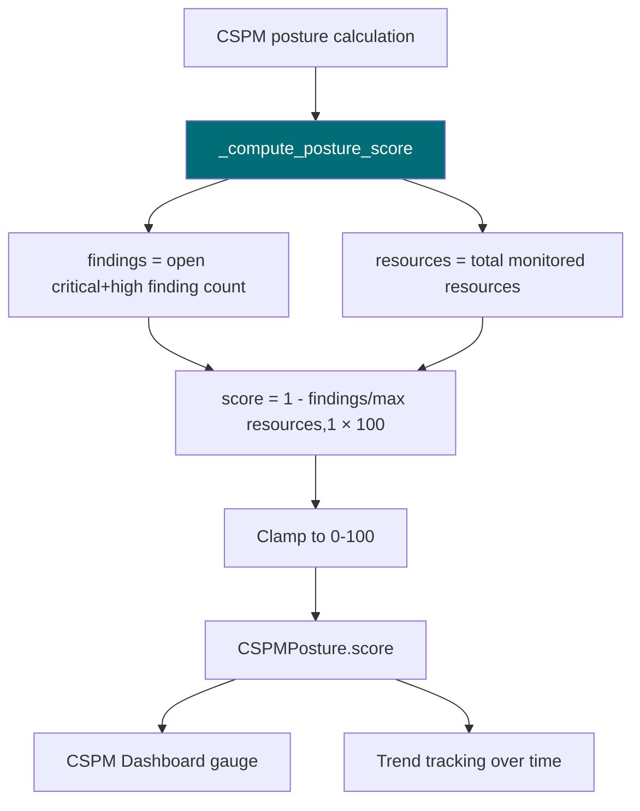

# PRD: Community 535 — cspm_engine.CSPMEngine._compute_posture_score

## Master Goal Mapping
**ALDECI Pillar**: CSPM — Cloud Posture Score  
**Persona**: Cloud Security Engineer, CISO  
**Business Value**: Computes a 0-100 cloud security posture score using the formula `(1 - findings/max(resources, 1)) × 100`, providing a simple normalized metric for trend tracking and SLA compliance on cloud misconfiguration remediation.

## Architecture Diagram


## Code Proof
**File**: `suite-core/core/cspm_engine.py`  
```python
def _compute_posture_score(self, findings: int, resources: int) -> float:
    """Score = (1 - findings / max(resources, 1)) * 100, clamped to [0, 100]."""
    raw = (1.0 - findings / max(resources, 1)) * 100.0
    return round(max(0.0, min(100.0, raw)), 1)
```

## Inter-Dependencies
- **Upstream**: `_count_findings` (Community 534) provides finding count
- **Downstream**: `CSPMPosture.score`, posture trend engine, CISO report
- **Sibling**: `posture_scoring.PostureScoreEngine` (Community 496 — 6-component model)

## Data Flow
```
resources = 450 (monitored cloud resources)
findings = 27 (open critical+high misconfigs)
  → _compute_posture_score(27, 450)
    → raw = (1 - 27/450) × 100 = 94.0
    → clamped: 94.0
  → CSPMPosture.score = 94.0 → Grade A (excellent)
```

## Referenced Docs
- `suite-core/core/cspm_engine.py`

## Acceptance Criteria
- [ ] findings=0 → 100.0 (perfect posture)
- [ ] findings=resources → 0.0 (all resources misconfigured)
- [ ] resources=0 → 100.0 (no resources = no issues, max guard)
- [ ] Score clamped to [0.0, 100.0]
- [ ] findings > resources → clamped to 0.0 (not negative)

## Effort Estimate
**XS** — 0.5 days. Function complete; boundary tests including resources=0.

## Status
**COMPLETE** — Implementation exists. Boundary tests needed.
