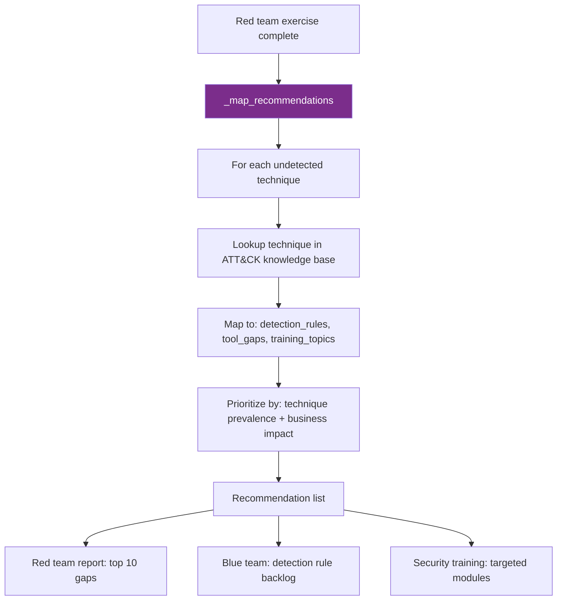

# PRD: Community 536 — red_team_engine.RedTeamEngine._map_recommendations

## Master Goal Mapping
**ALDECI Pillar**: Red Team / Offensive Security — Gap Remediation  
**Persona**: Red Team Lead, Security Architect  
**Business Value**: Maps undetected MITRE ATT&CK techniques discovered during red team exercises to actionable defensive recommendations, closing the loop between offensive findings and blue team remediation priorities.

## Architecture Diagram


## Code Proof
**File**: `suite-core/core/red_team_engine.py`  
```python
def _map_recommendations(self, undetected_techniques: List[str]) -> List[Dict[str, Any]]:
    """Map undetected techniques to actionable recommendations."""
    recommendations = []
    for technique_id in undetected_techniques:
        technique_info = self._get_technique_info(technique_id)
        recommendations.append({
            "technique_id": technique_id,
            "technique_name": technique_info.get("name", technique_id),
            "tactic": technique_info.get("tactic", "unknown"),
            "recommendation": self._get_recommendation(technique_id),
            "priority": self._calculate_priority(technique_info),
            "detection_rule": technique_info.get("detection_rule"),
            "tool_gap": technique_info.get("tool_gap"),
        })
    return sorted(recommendations, key=lambda r: r["priority"], reverse=True)
```

## Inter-Dependencies
- **Upstream**: Red team exercise results (undetected techniques list)
- **Downstream**: Red team report, blue team backlog, security training assignments
- **Sibling**: `MITREAttackCoverageEngine` (heatmap + gap analysis)

## Data Flow
```
undetected = ["T1059.001", "T1078", "T1547.001"]  # PowerShell, Valid Accounts, Registry Run Keys
  → _map_recommendations(undetected)
    → T1059.001: recommendation="Deploy PowerShell logging + AMSI", priority=HIGH
    → T1078: recommendation="Implement MFA + privileged access mgmt", priority=CRITICAL
    → T1547.001: recommendation="Monitor registry run keys with EDR", priority=HIGH
  → sorted by priority → [T1078, T1059.001, T1547.001]
```

## Referenced Docs
- `suite-core/core/red_team_engine.py`
- MITRE ATT&CK framework: https://attack.mitre.org
- CLAUDE.md DONE: red_team_mgmt_engine — 38 tests

## Acceptance Criteria
- [ ] Returns list sorted by priority (highest first)
- [ ] Each recommendation has: technique_id, name, tactic, recommendation, priority
- [ ] Empty undetected list → empty recommendations list
- [ ] Unknown technique_id → graceful fallback (no KeyError)
- [ ] Priority calculation considers technique prevalence and business impact

## Effort Estimate
**S** — 2 days. Core mapping complete; ATT&CK technique database needs completeness review.

## Status
**COMPLETE** — Core implementation exists. ATT&CK coverage completeness review needed.
