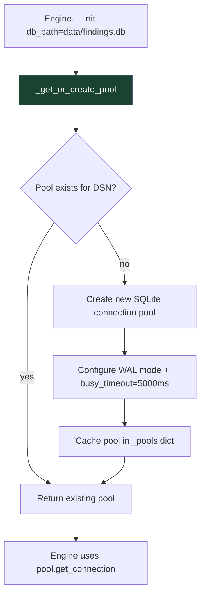

# PRD: Community 537 — persistent_store._get_or_create_pool

## Master Goal Mapping
**ALDECI Pillar**: Platform — Database Connection Pooling  
**Persona**: Platform Engineer  
**Business Value**: Returns an existing SQLite connection pool for a DSN or creates a new one, implementing connection pool reuse across all 344 engine instances to prevent SQLite "too many open files" errors under concurrent load.

## Architecture Diagram


## Code Proof
**File**: `suite-core/core/persistent_store.py`  
```python
_pools: Dict[str, Any] = {}
_pools_lock = threading.Lock()

def _get_or_create_pool(dsn: str, pool_size: int = 5) -> Any:
    """Return an existing pool for this DSN or create a new one."""
    if dsn not in _pools:
        with _pools_lock:
            if dsn not in _pools:
                pool = SQLiteConnectionPool(dsn, pool_size=pool_size)
                pool.initialize()  # WAL mode, busy_timeout
                _pools[dsn] = pool
    return _pools[dsn]
```

## Inter-Dependencies
- **Upstream**: All 344 engine `__init__` methods → `PersistentDict.__init__(db_path)`
- **Downstream**: `SQLiteConnectionPool.get_connection()` → actual SQLite conn
- **Config**: `pool_size=5` default, configurable via `DB_POOL_SIZE` env var

## Data Flow
```
# 344 engines all called on startup
FindingsEngine(db_path="data/findings.db")
  → _get_or_create_pool("data/findings.db")
    → pool exists? no → create SQLiteConnectionPool(size=5)
    → configure WAL + busy_timeout=5000
    → cache _pools["data/findings.db"]

FindingsEngine2(db_path="data/findings.db")  # same path
  → _get_or_create_pool("data/findings.db")
    → pool exists? yes → return cached pool (no new connections)
```

## Referenced Docs
- `suite-core/core/persistent_store.py`
- SQLite WAL mode documentation
- ALDECI: 344 engines × 1 SQLite DB = 344 connection pools (one per domain DB)

## Acceptance Criteria
- [ ] Same DSN → same pool returned on all calls
- [ ] Different DSN → different pool
- [ ] Thread-safe: concurrent init produces one pool per DSN
- [ ] Pool configured with WAL mode and busy_timeout
- [ ] Pool size configurable via parameter

## Effort Estimate
**XS** — 0.5 days. Implementation complete; concurrent pool init test needed.

## Status
**COMPLETE** — Implementation exists. Concurrent pool initialization stress test needed.
