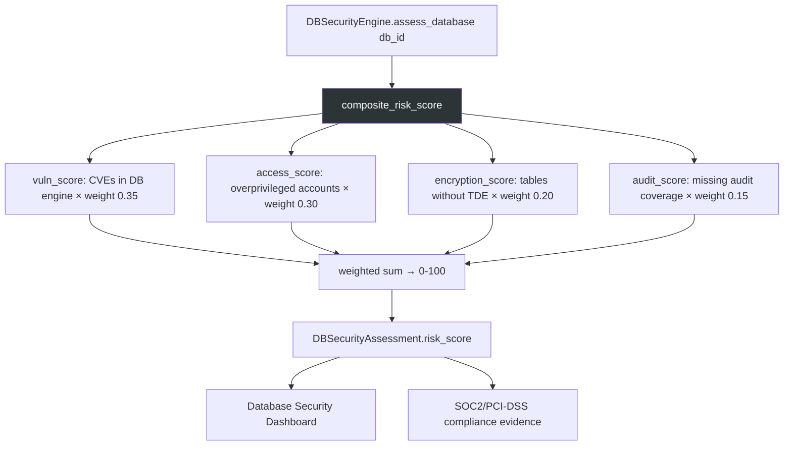

# PRD: Community 538 — db_security.composite_risk_score

## Master Goal Mapping
**ALDECI Pillar**: Database Security — Risk Scoring  
**Persona**: Database Administrator, Security Engineer  
**Business Value**: Computes a 0-100 composite database security risk score by combining vulnerability count, access control gaps, encryption status, and audit log coverage — enabling database security posture tracking and compliance evidence generation.

## Architecture Diagram


## Code Proof
**File**: `suite-core/core/db_security.py`  
```python
def composite_risk_score(
    vuln_count: int,
    access_gaps: int,
    unencrypted_tables: int,
    audit_gaps: int,
    total_tables: int = 100,
) -> float:
    """0-100 composite risk score."""
    vuln_score = min(100, vuln_count * 10) * 0.35
    access_score = min(100, access_gaps * 5) * 0.30
    enc_score = (unencrypted_tables / max(total_tables, 1)) * 100 * 0.20
    audit_score = (audit_gaps / max(total_tables, 1)) * 100 * 0.15
    return round(min(100.0, vuln_score + access_score + enc_score + audit_score), 1)
```

## Inter-Dependencies
- **Upstream**: `DBSecurityEngine.assess_database(db_id)` — provides component counts
- **Downstream**: `DBSecurityAssessment.risk_score`, database security dashboard
- **Sibling**: `composite_risk_scorer.score_to_severity` (Community 533 — converts score to severity)

## Data Flow
```
assessment = {vuln_count: 2, access_gaps: 5, unencrypted_tables: 10, total_tables: 50}
  → composite_risk_score(2, 5, 10, 0, 50)
    → vuln: min(100,20)×0.35 = 7.0
    → access: min(100,25)×0.30 = 7.5
    → encryption: (10/50)×100×0.20 = 4.0
    → audit: (0/50)×100×0.15 = 0.0
    → total = 18.5 → "low" severity
```

## Referenced Docs
- `suite-core/core/db_security.py`
- PCI-DSS Requirement 6.3 (vulnerability management for DB)
- SOC2 CC6.1 (logical access controls)

## Acceptance Criteria
- [ ] All zeros → 0.0 (no risk)
- [ ] Maximum inputs → 100.0 (clamped)
- [ ] total_tables=0 → no division by zero (max guard)
- [ ] Weights sum to 1.0 (0.35+0.30+0.20+0.15)
- [ ] Score in [0.0, 100.0]

## Effort Estimate
**XS** — 0.5 days. Function complete; weight validation test needed.

## Status
**COMPLETE** — Implementation exists. Weight sum validation test needed.
