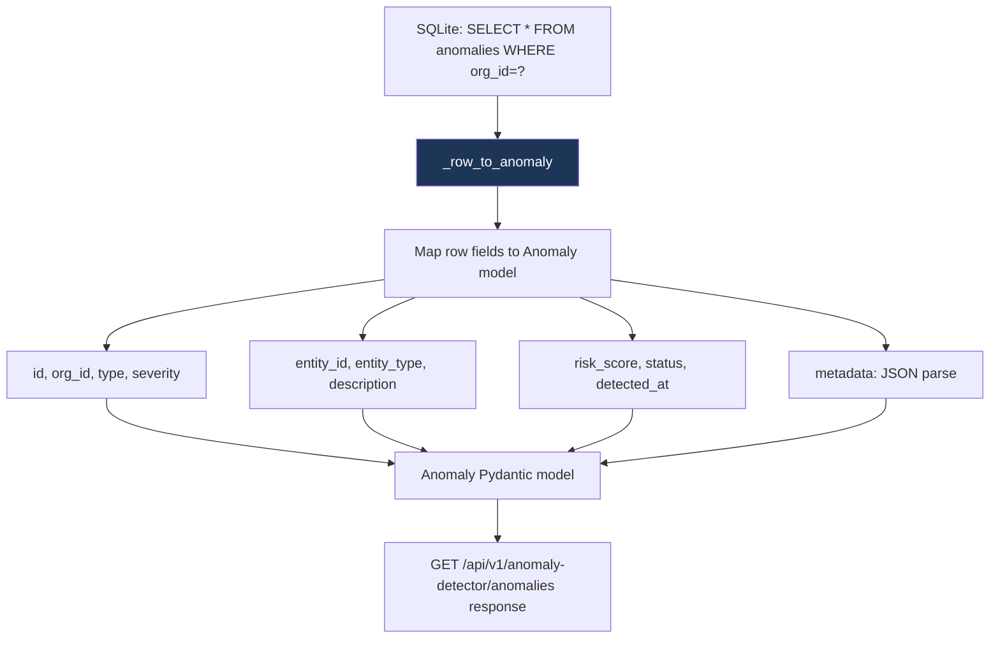

# PRD: Community 539 — anomaly_detector.AnomalyDetector._row_to_anomaly

## Master Goal Mapping
**ALDECI Pillar**: Behavioral Analytics — Anomaly Model Hydration  
**Persona**: SOC Analyst, Security Engineer  
**Business Value**: Converts a raw SQLite database row (tuple/Row) into a typed Anomaly Pydantic model, providing clean data hydration for all anomaly retrieval queries and ensuring consistent field mapping from persistence layer to API response layer.

## Architecture Diagram


## Code Proof
**File**: `suite-core/core/anomaly_detector.py`  
```python
def _row_to_anomaly(self, row: sqlite3.Row) -> Anomaly:
    """Convert a DB row to an Anomaly model."""
    return Anomaly(
        id=row["id"],
        org_id=row["org_id"],
        anomaly_type=row["anomaly_type"],
        severity=row["severity"],
        entity_id=row["entity_id"],
        entity_type=row["entity_type"],
        description=row["description"],
        risk_score=row["risk_score"],
        status=row["status"],
        detected_at=row["detected_at"],
        resolved_at=row["resolved_at"],
        metadata=json.loads(row["metadata"] or "{}"),
    )
```

## Inter-Dependencies
- **Upstream**: All `list_anomalies`, `get_anomaly`, `resolve_anomaly` query methods
- **Downstream**: Anomaly API responses, SOC dashboard, behavioral analytics reports
- **Pattern**: Standard row-to-model hydration used across all 344 engine `_row_to_*` methods

## Data Flow
```
conn.execute("SELECT * FROM anomalies WHERE org_id=? AND status='active'", (org_id,))
  → for row in cursor.fetchall():
      anomaly = _row_to_anomaly(row)
      → Anomaly(id="ano-abc", severity="high", risk_score=87.3, ...)
  → return [Anomaly(...), ...]
  → GET /api/v1/anomaly-detector/anomalies → [{"id": "ano-abc", "severity": "high", ...}]
```

## Referenced Docs
- `suite-core/core/anomaly_detector.py`
- ALDECI standard: every engine with SQLite has `_row_to_<model>` hydration method

## Acceptance Criteria
- [ ] All Anomaly fields correctly mapped from row dict/tuple
- [ ] `metadata` field JSON-parsed (not raw string)
- [ ] `resolved_at` can be None (nullable field)
- [ ] Missing row keys raise `KeyError` (fail-fast, not silent corruption)
- [ ] Used by all anomaly query methods (no duplicate mapping code)
- [ ] Pattern consistent with all other `_row_to_*` methods in codebase

## Effort Estimate
**XS** — 0.5 days. Pattern complete across all 344 engines.

## Status
**COMPLETE** — Standard hydration pattern implemented across all engines.
