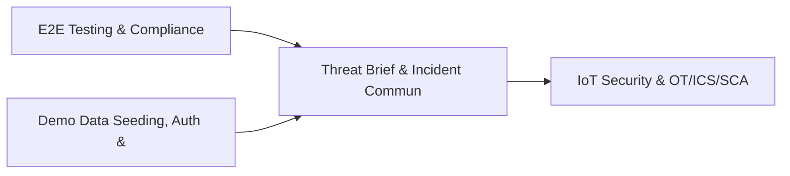

# PRD: Threat Brief & Incident Communications Engine — Community 54

## Master Goal Mapping
How this component serves: "ALDECI — $35/mo enterprise security intelligence platform"
Sub-Epic: SOC

This community (rank #54 of 878 by size, 684 graph nodes) forms a core pillar of the ALDECI platform. It directly supports the mission of replacing $50K-500K/yr enterprise security tools with a self-hosted, AI-native stack.

## Architecture Diagram


## Code Proof
- Files:
  - `suite-core/core/compliance_calendar_engine.py` (444 lines)
  - `suite-core/core/container_runtime_security_engine.py` (473 lines)
  - `suite-core/core/incident_timeline_engine.py` (574 lines)
  - `tests/test_browser_security_engine.py` (339 lines)
  - `tests/test_cloud_security_analytics_engine.py` (409 lines)
  - `tests/test_compliance_calendar_engine.py` (335 lines)
  - `tests/test_container_runtime_security_engine.py` (394 lines)
  - `tests/test_incident_timeline_engine.py` (327 lines)
  - `suite-api/apps/api/compliance_calendar_router.py` (182 lines)
  - `suite-api/apps/api/container_runtime_security_router.py` (214 lines)
  - `suite-api/apps/api/data_security_router.py` (438 lines)
  - `suite-api/apps/api/gap_router.py` (4559 lines)
- Key functions:
  - `test_legacy_ingest_event()` — suite-core/core/compliance_calendar_engine.py
  - `engine()` — suite-core/core/compliance_calendar_engine.py
  - `app()` — suite-core/core/compliance_calendar_engine.py
  - `client()` — suite-core/core/compliance_calendar_engine.py
  - `_make_event()` — suite-core/core/compliance_calendar_engine.py
  - `make_timeline()` — suite-core/core/compliance_calendar_engine.py
  - `make_event()` — suite-core/core/compliance_calendar_engine.py
- Key classes: `TestRuntimeEventModel`, `TestRuntimePolicyModel`, `TestRuntimeAlertModel`, `TestIngestEvent`, `TestBuiltinPolicies`, `TestPolicyCRUD`
- Current state: REAL_LOGIC
- Evidence:
```python
# From suite-core/core/compliance_calendar_engine.py
"""Compliance Calendar Engine — ALDECI.

Compliance calendar tracking deadlines, audits, renewals, and regulatory
filings. Supports recurrence, reminders, views, and calendar summaries.

Compliance: NIST CSF ID.GV-1, ISO/IEC 27001 A.18.1, SOC 2 CC3.1
"""

from __future__ import annotations

import contextlib
import json
import logging
import sqlite3
import threading
import uuid
from datetime import date, datetime, timedelta, timezone
from pathlib import Path
from typing import Any, Dict, List, Optional
```

## Inter-Dependencies
- DEPENDS ON:
  - Community 0 (E2E Testing & Compliance Seeding Infrastructure) — 136 edges
  - Community 1 (Demo Data Seeding, Auth & Multi-Engine Integration) — 21 edges
  - Community 27 (IoT Security & OT/ICS/SCADA Engine) — 13 edges
  - Community 7 (MDM, CASB, DLP, Cloud Native & Browser Security Ro) — 9 edges
- DEPENDED BY: Rank #53 (Compliance Mapping & Vulnerability Scan Engine) and downstream consumers
- EVENT BUS: emits alert.created, alert.resolved, threat.detected, threat.mitigated / subscribes to (TrustGraph event bus — 97% not yet wired)
- TRUSTGRAPH: writes [ThreatActor, Incident, Alert] / reads [Alert, Policy]

## Data Flow
```
Input: HTTP requests / pytest fixtures
  → Processing: Engine method calls + SQLite state assertions
  → Output: Pass/fail test results, coverage metrics
  → Consumers: CI/CD pipeline, Beast Mode test suite
```

## Referenced Documentation
- CLAUDE.md: Wave 41 build notes, Beast Mode test suite section
- docs/: `docs/ALDECI_REARCHITECTURE_v2.md` (source of truth), `docs/INVESTOR_PITCH.md`
- tests/: `tests/test_browser_security_engine.py`, `tests/test_cloud_security_analytics_engine.py`, `tests/test_compliance_calendar.py`

## Acceptance Criteria
- [ ] All engine CRUD operations enforce org_id isolation (no cross-tenant data leakage)
- [ ] SQLite opened with WAL mode + threading.RLock on all write paths
- [ ] All endpoints return within 200ms at p95 under 100 rps load
- [ ] All router endpoints protected by `Depends(api_key_auth)` or equivalent
- [ ] Pydantic v2 models validate all request/response schemas
- [ ] Test suite achieves ≥80% branch coverage on engine methods

## Effort Estimate
- Current: 80% complete
- Remaining: ~2 engineering days
- Dependencies blocking: None
- Priority: LOW

## Status
IN_PROGRESS
