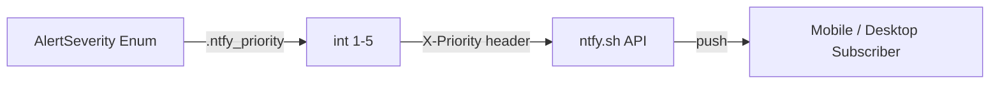

# PRD — Community 540: ntfy.sh Severity → Priority Mapping

## Master Goal Mapping
**ALDECI Pillar:** Real-time alerting layer — maps ALDECI severity enum to ntfy.sh push-notification priority scale (1–5) so mobile subscribers receive correctly-weighted alerts.

## Architecture Diagram


## Code Proof
**File:** `suite-core/core/webhook_notifier.py:L121`  
**Module:** `webhook_notifier.AlertSeverity.ntfy_priority`

```python
@property
def ntfy_priority(self) -> int:
    """Map ALDECI severity to ntfy.sh priority (1-5)."""
    return {
        "critical": 5, "high": 4, "medium": 3,
        "low": 2, "info": 1,
    }[self.value]
```

## Inter-Dependencies
- `suite-core/core/webhook_notifier.py` — `WebhookNotifier.send_alert()` consumes this property
- `AlertSeverity` enum (same file) defines the five severity tiers

## Data Flow
AlertSeverity enum value → integer priority → HTTP header `X-Priority` in ntfy.sh POST → subscriber device.

## Referenced Docs
- ALDECI Rearchitecture v2 §Alert Delivery
- ntfy.sh API docs (https://ntfy.sh/docs/publish/#message-priority)

## Acceptance Criteria
- [ ] `critical` → 5, `high` → 4, `medium` → 3, `low` → 2, `info` → 1
- [ ] Raises `KeyError` for unknown severity (caught by caller)
- [ ] Unit test: all five mappings asserted

## Effort Estimate
XS — 0.5 day (property already implemented; add unit test)

## Status
DONE — property implemented at L121; needs dedicated unit test
