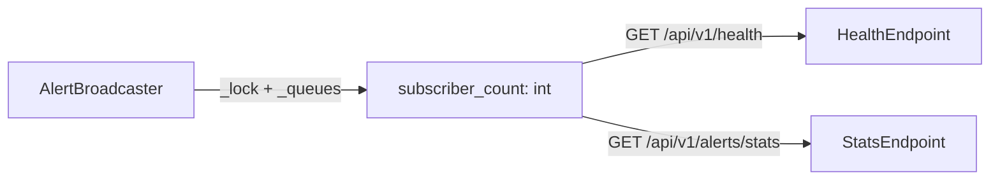

# PRD — Community 542: AlertBroadcaster — Active Subscriber Count

## Master Goal Mapping
**ALDECI Pillar:** Real-time SSE/WebSocket alerting bus — exposes the current number of active SSE subscribers so health endpoints and dashboards can report fan-out capacity.

## Architecture Diagram


## Code Proof
**File:** `suite-core/core/alert_broadcaster.py:L165`  
**Module:** `alert_broadcaster.AlertBroadcaster.subscriber_count`

```python
@property
def subscriber_count(self) -> int:
    """Number of active subscribers."""
    with self._lock:
        return len(self._queues)
```

## Inter-Dependencies
- `subscribe()` / `unsubscribe()` — mutate `_queues`
- `broadcast()` / `broadcast_to_tenant()` — use snapshot of `_queues`
- Health router — consumes `subscriber_count` for monitoring

## Data Flow
Thread-safe read of `_queues` dict length under `threading.Lock` → integer returned to caller.

## Referenced Docs
- ALDECI Rearchitecture v2 §Real-time Event Bus
- Python `threading.Lock` docs

## Acceptance Criteria
- [ ] Returns 0 when no subscribers
- [ ] Increments by 1 per `subscribe()` call
- [ ] Decrements by 1 per `unsubscribe()` call
- [ ] Thread-safe: concurrent subscribe/unsubscribe does not corrupt count

## Effort Estimate
XS — 0.5 day (already implemented; add concurrency test)

## Status
DONE — implemented at L165
