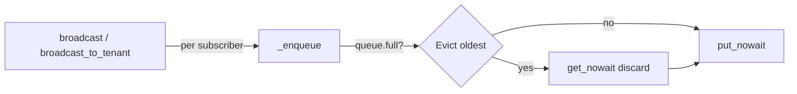

# PRD — Community 543: AlertBroadcaster — Bounded Queue with Oldest-Eviction

## Master Goal Mapping
**ALDECI Pillar:** Real-time alerting bus — ensures per-subscriber alert queues never overflow by atomically dropping the oldest item before inserting a new one.

## Architecture Diagram


## Code Proof
**File:** `suite-core/core/alert_broadcaster.py:L241`  
**Module:** `alert_broadcaster.AlertBroadcaster._enqueue`

```python
@staticmethod
def _enqueue(q: asyncio.Queue, alert: Dict[str, Any]) -> None:
    """Put alert into queue, evicting oldest if full."""
    if q.full():
        try:
            q.get_nowait()  # drop oldest
        except asyncio.QueueEmpty:
            pass
    try:
        q.put_nowait(alert)
    except asyncio.QueueFull:
        pass  # race condition — skip silently
```

## Inter-Dependencies
- `broadcast()` — calls `_enqueue` for all subscribers
- `broadcast_to_tenant()` — calls `_enqueue` for tenant-scoped subscribers
- `asyncio.Queue` — maxsize set during `subscribe()`

## Data Flow
Caller iterates subscriber queues → `_enqueue` called per queue → full check → optional eviction → put_nowait.

## Referenced Docs
- ALDECI Rearchitecture v2 §Backpressure Strategy
- Python asyncio.Queue docs

## Acceptance Criteria
- [ ] Full queue: oldest item dropped, new alert inserted
- [ ] Non-full queue: alert inserted directly
- [ ] Race condition (QueueFull after eviction): silently skipped
- [ ] No exception propagates to caller

## Effort Estimate
XS — 0.5 day (implemented; add queue-full unit test)

## Status
DONE — implemented at L241
