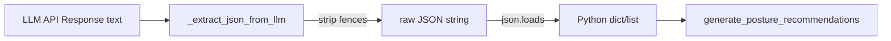

# PRD — Community 544: AI Security Advisor — LLM JSON Response Parser

## Master Goal Mapping
**ALDECI Pillar:** AI-native security advisory layer — strips markdown fences from LLM output before JSON parsing, enabling reliable structured extraction from Qwen/Opus responses.

## Architecture Diagram


## Code Proof
**File:** `suite-core/core/ai_security_advisor_engine.py:L430`  
**Module:** `ai_security_advisor_engine.AISecurityAdvisorEngine._extract_json_from_llm`

```python
@staticmethod
def _extract_json_from_llm(text: str) -> Any:
    """Try to parse JSON from LLM response, stripping markdown fences."""
    text = text.strip()
    if text.startswith("```"):
        lines = text.split("\n")
        inner, in_block = [], False
        for line in lines:
            if line.startswith("```") and not in_block:
                in_block = True; continue
            if line.startswith("```") and in_block: break
            if in_block: inner.append(line)
        text = "\n".join(inner)
    return json.loads(text)
```

## Inter-Dependencies
- `generate_posture_recommendations()` — primary consumer
- `generate_threat_assessment()` — also uses this helper
- `ai_security_advisor_router.py` — FastAPI router calling the engine

## Data Flow
Raw LLM text → fence-stripping → `json.loads()` → structured Python object → returned to recommendation builder.

## Referenced Docs
- ALDECI Rearchitecture v2 §LLM Consensus Layer
- Qwen 3.6 Max API (OpenRouter)

## Acceptance Criteria
- [ ] Bare JSON (no fences) parsed correctly
- [ ] ```json...``` fences stripped before parse
- [ ] ``` (no lang tag) fences stripped
- [ ] Invalid JSON raises `json.JSONDecodeError` (not silenced)
- [ ] Empty string raises error (not returned as None)

## Effort Estimate
S — 1 day (implemented; needs test coverage for all fence variants)

## Status
DONE — implemented at L430
