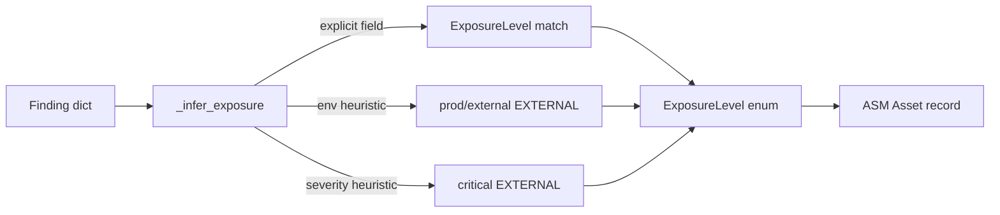

# PRD — Community 545: Attack Surface Manager — Exposure Level Inference

## Master Goal Mapping
**ALDECI Pillar:** Attack Surface Management (ASM) — infers asset exposure level (EXTERNAL/DMZ/INTERNAL) from finding metadata using explicit values first, then environment/severity heuristics.

## Architecture Diagram


## Code Proof
**File:** `suite-core/core/attack_surface.py:L429`  
**Module:** `attack_surface.AttackSurfaceEngine._infer_exposure`

```python
@staticmethod
def _infer_exposure(finding: Dict[str, Any]) -> ExposureLevel:
    """Infer exposure level from finding metadata."""
    exposure = finding.get("exposure") or finding.get("exposure_level", "")
    if isinstance(exposure, str):
        for level in ExposureLevel:
            if level.value in exposure.lower():
                return level
    severity = str(finding.get("severity", "")).lower()
    env = str(finding.get("environment", "") or finding.get("env", "")).lower()
    if "prod" in env or "external" in env or "public" in env:
        return ExposureLevel.EXTERNAL
    if "dmz" in env: return ExposureLevel.DMZ
    if "internal" in env or "private" in env: return ExposureLevel.INTERNAL
    if "critical" in severity: return ExposureLevel.EXTERNAL
    return ExposureLevel.INTERNAL
```

## Inter-Dependencies
- `discover_assets_from_findings()` — calls `_infer_exposure` per finding
- `ExposureLevel` enum — EXTERNAL/DMZ/INTERNAL/ISOLATED
- `attack_surface_engine_router.py` — `/api/v1/asm`

## Data Flow
Finding dict → explicit exposure field check → environment string heuristics → severity fallback → `ExposureLevel` enum returned.

## Referenced Docs
- ALDECI Rearchitecture v2 §Attack Surface Management
- CTEM (Continuous Threat Exposure Management) methodology

## Acceptance Criteria
- [ ] Explicit `exposure=external` → EXTERNAL
- [ ] `environment=production` → EXTERNAL
- [ ] `severity=critical` + no env → EXTERNAL
- [ ] `environment=internal` → INTERNAL
- [ ] Default (no hints) → INTERNAL

## Effort Estimate
S — 1 day (implemented; needs parametrized test matrix)

## Status
DONE — implemented at L429
