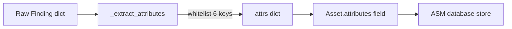

# PRD — Community 546: Attack Surface Manager — Finding Attribute Extractor

## Master Goal Mapping
**ALDECI Pillar:** ASM data enrichment — extracts a curated subset of finding metadata fields (port, protocol, cloud_provider, region, severity, scanner) into asset attribute dictionaries.

## Architecture Diagram


## Code Proof
**File:** `suite-core/core/attack_surface.py:L452`  
**Module:** `attack_surface.AttackSurfaceEngine._extract_attributes`

```python
@staticmethod
def _extract_attributes(finding: Dict[str, Any]) -> Dict[str, Any]:
    """Extract useful attributes from a finding."""
    attrs: Dict[str, Any] = {}
    for key in ("port", "protocol", "cloud_provider",
                "region", "severity", "scanner"):
        if key in finding:
            attrs[key] = finding[key]
    return attrs
```

## Inter-Dependencies
- `discover_assets_from_findings()` — passes finding to this method
- `Asset` dataclass — stores returned dict in `.attributes`
- C545 `_infer_exposure` — sibling helper on same code path

## Data Flow
Finding dict → whitelist key extraction → attributes dict → stored in `Asset.attributes` JSON field in ASM SQLite.

## Referenced Docs
- ALDECI Rearchitecture v2 §Attack Surface Management
- ASM asset schema docs

## Acceptance Criteria
- [ ] Only whitelisted keys present in output
- [ ] Missing keys silently omitted (no KeyError)
- [ ] Empty finding returns empty dict
- [ ] All 6 keys present when finding is fully populated

## Effort Estimate
XS — 0.5 day (implemented; add whitelist test)

## Status
DONE — implemented at L452
