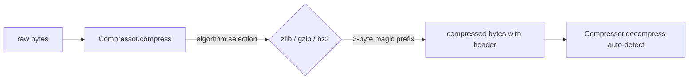

# PRD — Community 548: ZeroGravity Compressor — Magic-Header Compress

## Master Goal Mapping
**ALDECI Pillar:** ZeroGravity ML compression layer — compresses raw bytes using zlib/gzip/bz2 and prepends a 3-byte magic header enabling automatic algorithm detection on decompress.

## Architecture Diagram


## Code Proof
**File:** `suite-core/core/zero_gravity.py:L129`  
**Module:** `zero_gravity.Compressor.compress`

```python
MAGIC = {"zlib": b"ZG\x01", "gzip": b"ZG\x02", "bz2": b"ZG\x03"}

@staticmethod
def compress(data: bytes, algorithm: str = "zlib") -> bytes:
    """Compress data with magic header for auto-detection."""
    if algorithm == "zlib":
        return Compressor.MAGIC["zlib"] + zlib.compress(data, level=6)
    elif algorithm == "gzip":
        return Compressor.MAGIC["gzip"] + gzip.compress(data, compresslevel=6)
    elif algorithm == "bz2":
        import bz2
        return Compressor.MAGIC["bz2"] + bz2.compress(data, compresslevel=6)
    else:
        raise ValueError(f"Unknown compression: {algorithm}")
```

## Inter-Dependencies
- `Compressor.decompress()` — C549, reads magic header
- `Compressor.ratio()` — C550, measures savings
- ZeroGravity context store — uses Compressor for payload storage

## Data Flow
Raw bytes → algorithm choice → stdlib compress → magic header prepend → compressed blob stored or transmitted.

## Referenced Docs
- ALDECI Rearchitecture v2 §Context Compression
- Python zlib / gzip / bz2 stdlib docs

## Acceptance Criteria
- [ ] zlib output starts with `ZG\x01`
- [ ] gzip output starts with `ZG\x02`
- [ ] bz2 output starts with `ZG\x03`
- [ ] Unknown algorithm raises `ValueError`
- [ ] Round-trip: `decompress(compress(data))` == data

## Effort Estimate
S — 1 day (implemented; add round-trip tests for all three algorithms)

## Status
DONE — implemented at L129
