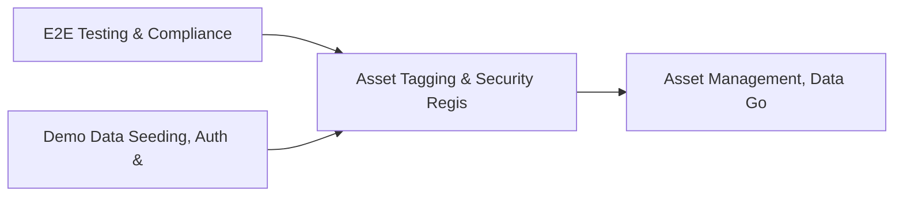

# PRD: Asset Tagging & Security Registry Engine — Community 55

## Master Goal Mapping
How this component serves: "ALDECI — $35/mo enterprise security intelligence platform"
Sub-Epic: GRC

This community (rank #55 of 878 by size, 657 graph nodes) forms a core pillar of the ALDECI platform. It directly supports the mission of replacing $50K-500K/yr enterprise security tools with a self-hosted, AI-native stack.

## Architecture Diagram


## Code Proof
- Files:
  - `suite-core/core/certificate_lifecycle_engine.py` (399 lines)
  - `suite-core/core/pki_management_engine.py` (456 lines)
  - `tests/test_certificate_lifecycle_engine.py` (310 lines)
  - `tests/test_network_traffic_engine.py` (319 lines)
  - `tests/test_operational_technology_security_engine.py` (413 lines)
  - `tests/test_pki_management_engine.py` (309 lines)
  - `tests/test_security_training_engine.py` (498 lines)
  - `suite-api/apps/api/cert_router.py` (184 lines)
  - `suite-api/apps/api/certificate_lifecycle_router.py` (173 lines)
  - `suite-api/apps/api/gcp_scc_router.py` (256 lines)
  - `suite-api/apps/api/network_analyzer_router.py` (177 lines)
  - `suite-api/apps/api/network_security_router.py` (630 lines)
- Key functions:
  - `tmp_db()` — suite-core/core/certificate_lifecycle_engine.py
  - `analyzer()` — suite-core/core/certificate_lifecycle_engine.py
  - `populated_analyzer()` — suite-core/core/certificate_lifecycle_engine.py
  - `client()` — suite-core/core/certificate_lifecycle_engine.py
- Key classes: `TestNetworkZone`, `TestNetworkFlow`, `TestSegmentationViolation`, `TestPolicyCheck`, `TestDefineZone`, `TestAddFlow`
- Current state: REAL_LOGIC
- Evidence:
```python
# From suite-core/core/certificate_lifecycle_engine.py
"""Certificate Lifecycle Engine — ALDECI.

Tracks SSL/TLS, code-signing, client, and CA certificates across their full
lifecycle: registration, expiry monitoring, renewal, and revocation.

Compliance: NIST SP 800-57, CABF Baseline Requirements, ISO/IEC 27001 A.10
"""

from __future__ import annotations

import json
import logging
import sqlite3
import threading
import uuid
from datetime import datetime, timedelta, timezone
from pathlib import Path
from typing import Any, Dict, List, Optional

try:
```

## Inter-Dependencies
- DEPENDS ON:
  - Community 0 (E2E Testing & Compliance Seeding Infrastructure) — 123 edges
  - Community 1 (Demo Data Seeding, Auth & Multi-Engine Integration) — 43 edges
  - Community 8 (Asset Management, Data Governance & Risk Calculato) — 21 edges
  - Community 17 (Risk Register, Device Segmentation & Isolation Tes) — 6 edges
- DEPENDED BY: Rank #54 (Threat Brief & Incident Communications Engine) and downstream consumers
- EVENT BUS: emits compliance.status_changed, policy.violated, policy.enforced / subscribes to (TrustGraph event bus — 97% not yet wired)
- TRUSTGRAPH: writes [ThreatActor, Policy, ComplianceControl] / reads [ComplianceControl, NetworkAsset]

## Data Flow
```
Input: HTTP requests / pytest fixtures
  → Processing: Engine method calls + SQLite state assertions
  → Output: Pass/fail test results, coverage metrics
  → Consumers: CI/CD pipeline, Beast Mode test suite
```

## Referenced Documentation
- CLAUDE.md: Wave 41 build notes, Beast Mode test suite section
- docs/: `docs/ALDECI_REARCHITECTURE_v2.md` (source of truth), `docs/INVESTOR_PITCH.md`
- tests/: `tests/test_attack_surface_manager.py`, `tests/test_cert_manager.py`, `tests/test_certificate_lifecycle_engine.py`

## Acceptance Criteria
- [ ] All engine CRUD operations enforce org_id isolation (no cross-tenant data leakage)
- [ ] SQLite opened with WAL mode + threading.RLock on all write paths
- [ ] All endpoints return within 200ms at p95 under 100 rps load
- [ ] All router endpoints protected by `Depends(api_key_auth)` or equivalent
- [ ] Pydantic v2 models validate all request/response schemas
- [ ] Test suite achieves ≥80% branch coverage on engine methods

## Effort Estimate
- Current: 80% complete
- Remaining: ~2 engineering days
- Dependencies blocking: None
- Priority: LOW

## Status
IN_PROGRESS
