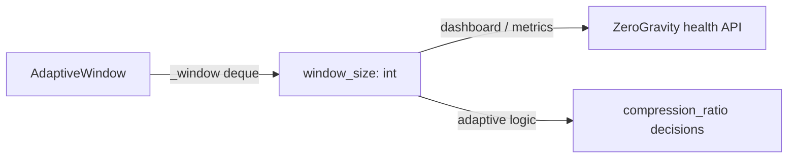

# PRD — Community 551: ZeroGravity — Adaptive Window Size Property

## Master Goal Mapping
**ALDECI Pillar:** ZeroGravity ML context layer — exposes the current adaptive sliding window size for context management, enabling dynamic adjustment based on data stream characteristics.

## Architecture Diagram


## Code Proof
**File:** `suite-core/core/zero_gravity.py:L942`  
**Module:** `zero_gravity.AdaptiveWindow.window_size`

```python
@property
def window_size(self) -> int:
    """Current adaptive window size."""
    return len(self._window)
```

## Inter-Dependencies
- `AdaptiveWindow._window` — the underlying deque
- `AdaptiveWindow.mean` — sibling property using same deque
- C550 `ratio()` — feeds data into window for adaptation

## Data Flow
Deque length read → integer window size → consumed by adaptive compression policy and monitoring.

## Referenced Docs
- ALDECI Rearchitecture v2 §Context Compression
- Streaming statistics / adaptive window algorithms

## Acceptance Criteria
- [ ] Empty window → 0
- [ ] After N pushes → N (up to maxlen)
- [ ] After maxlen+1 pushes → maxlen (circular eviction)
- [ ] Thread-safe read under GIL

## Effort Estimate
XS — 0.5 day (property implemented; add size-tracking test)

## Status
DONE — implemented at L942
