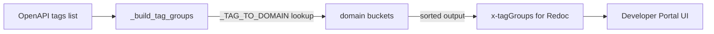

# PRD — Community 554: API Doc Generator — Tag Display Group Organizer

## Master Goal Mapping
**ALDECI Pillar:** OpenAPI developer portal — groups API endpoint tags into domain-based display sections for Redoc/Stoplight rendering, improving developer navigation of 570+ endpoints.

## Architecture Diagram


## Code Proof
**File:** `suite-core/core/api_doc_generator.py:L510`  
**Module:** `api_doc_generator.APIDocGenerator._build_tag_groups`

```python
@staticmethod
def _build_tag_groups(tags: List[Dict[str, Any]]) -> List[Dict[str, Any]]:
    """Organise tags into display groups for Redoc / Stoplight."""
    domain_tags: Dict[str, List[str]] = {}
    for tag_obj in tags:
        name = tag_obj.get("name", "")
        domain = _TAG_TO_DOMAIN.get(name.lower(), _TAG_TO_DOMAIN.get(name, "other"))
        domain_tags.setdefault(domain, []).append(name)
    return [
        {"name": domain.replace("_", " ").title(), "tags": sorted(tag_list)}
        for domain, tag_list in sorted(domain_tags.items())
    ]
```

## Inter-Dependencies
- `_TAG_TO_DOMAIN` dict — maps tag names to domain strings
- `generate_openapi_spec()` — calls this to enrich spec output
- `/api/v1/openapi` router — serves enriched spec
- C555 `_make_operation_id` — sibling helper in same class

## Data Flow
Raw OpenAPI tag list → domain lookup map → grouped dict → sorted tag-group list → injected as `x-tagGroups` in OpenAPI spec.

## Referenced Docs
- ALDECI Rearchitecture v2 §OpenAPI Developer Portal
- Redoc x-tagGroups extension docs
- Stoplight Elements tag group rendering

## Acceptance Criteria
- [ ] Tags grouped by domain correctly
- [ ] Unknown tags → `other` group
- [ ] Output sorted alphabetically by domain
- [ ] Tags within each group sorted alphabetically
- [ ] Domain names title-cased with underscores replaced by spaces

## Effort Estimate
S — 1 day (implemented; add grouping test with mock tag list)

## Status
DONE — implemented at L510
