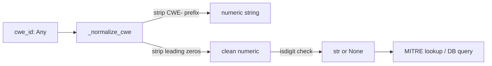

# PRD — Community 556: MITRE ATT&CK Mapper — CWE ID Normalizer

## Master Goal Mapping
**ALDECI Pillar:** MITRE ATT&CK correlation engine — strips `CWE-` prefix and leading zeros from CWE identifiers to produce bare numeric strings suitable for database lookups and comparisons.

## Architecture Diagram


## Code Proof
**File:** `suite-core/core/mitre_attack_mapper.py:L615`  
**Module:** `mitre_attack_mapper.MITREAttackMapper._normalize_cwe`

```python
@staticmethod
def _normalize_cwe(cwe_id: Any) -> Optional[str]:
    """Return bare numeric CWE string, e.g. 'CWE-89' -> '89'.""""""
    if cwe_id is None: return None
    s = str(cwe_id).strip().upper().lstrip("CWE-").lstrip("0")
    return s if s.isdigit() else None
```

## Inter-Dependencies
- `map_finding_to_attack()` — calls `_normalize_cwe` before ATT&CK lookup
- `_text_blob()` — sibling helper building search text
- MITRE ATT&CK CWE→technique mapping table

## Data Flow
Raw CWE value (any type) → string coercion → prefix strip → digit validation → normalized string or None.

## Referenced Docs
- ALDECI Rearchitecture v2 §MITRE ATT&CK Integration
- CWE (Common Weakness Enumeration) naming conventions
- MITRE ATT&CK framework CWE mappings

## Acceptance Criteria
- [ ] `'CWE-89'` → `'89'`
- [ ] `'089'` → `'89'` (leading zeros stripped)
- [ ] `None` → `None`
- [ ] Non-numeric string → `None`
- [ ] Integer `89` → `'89'`

## Effort Estimate
XS — 0.5 day (implemented; add normalization table test)

## Status
DONE — implemented at L615
