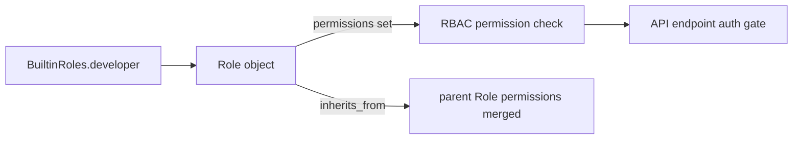

# PRD — Community 558: RBAC Built-in Role — developer

## Master Goal Mapping
**ALDECI Pillar:** Role-Based Access Control (RBAC) system — defines the `developer` built-in role with curated permission set and inheritance chain for ALDECI's 30-persona, 6-role enterprise security model.

## Architecture Diagram


## Code Proof
**File:** `suite-core/core/rbac.py:L159`  
**Module:** `rbac.BuiltinRoles.developer`

```python
@staticmethod
def developer() -> Role:
    """Developer + triage + autofix suggestions."""
    return Role(
        name="developer",
        permissions={...},  # FINDINGS_TRIAGE, AUTOFIX_VIEW, CONNECTORS_READ (+ viewer perms)
        inherits_from=viewer,
        org_scope=True,
        ...
    )
```

## Inter-Dependencies
- `BuiltinRoles.developer()` factory used by `RBACManager.create_default_roles()`
- `PersonaRoleMapping` — C565/C566 — maps 30 personas to these roles
- `RBACManager.check_permission()` — evaluates effective permissions
- `/api/v1/rbac` router — admin role management endpoints

## Data Flow
Factory static method → `Role` dataclass instantiation with permission set and inheritance → RBAC manager stores → permission checks at API boundaries.

## Referenced Docs
- ALDECI Rearchitecture v2 §RBAC & Persona Model
- NIST SP 800-207 (Zero Trust Architecture)
- RBAC standard (ANSI INCITS 359-2004)

## Acceptance Criteria
- [ ] Role name = `developer`
- [ ] Permission set contains exactly: FINDINGS_TRIAGE, AUTOFIX_VIEW, CONNECTORS_READ (+ viewer perms)
- [ ] Inheritance from `viewer` correctly merges parent permissions
- [ ] `org_scope=True` (scoped to organization)
- [ ] No permission outside defined set granted

## Effort Estimate
S — 1 day per role (all implemented; add permission inheritance integration tests)

## Status
DONE — implemented at L159
