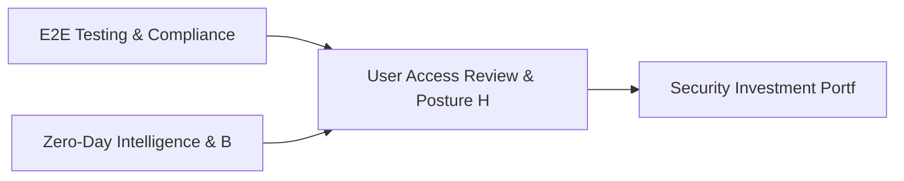

# PRD: User Access Review & Posture History Engine — Community 56

## Master Goal Mapping
How this component serves: "ALDECI — $35/mo enterprise security intelligence platform"
Sub-Epic: Identity

This community (rank #56 of 878 by size, 641 graph nodes) forms a core pillar of the ALDECI platform. It directly supports the mission of replacing $50K-500K/yr enterprise security tools with a self-hosted, AI-native stack.

## Architecture Diagram


## Code Proof
- Files:
  - `suite-api/apps/api/risk_quantification_engine_router.py` (178 lines)
  - `suite-core/core/risk_quantification_engine.py` (550 lines)
  - `suite-core/core/risk_quantification_engine_v2.py` (465 lines)
  - `suite-core/core/risk_scenario_engine.py` (462 lines)
  - `suite-core/core/threat_simulation_engine.py` (452 lines)
  - `tests/test_risk_aggregator_engine.py` (334 lines)
  - `tests/test_risk_quantification_engine.py` (346 lines)
  - `tests/test_risk_quantification_engine_v2.py` (463 lines)
  - `suite-api/apps/api/breach_simulation_router.py` (216 lines)
  - `suite-api/apps/api/risk_aggregator_router.py` (169 lines)
  - `suite-api/apps/api/risk_quantification_engine_router.py` (178 lines)
  - `suite-api/apps/api/risk_quantification_router.py` (209 lines)
- Key functions:
  - `_score()` — suite-api/apps/api/risk_quantification_engine_router.py
  - `test_record_risk_score_returns_dict()` — suite-api/apps/api/risk_quantification_engine_router.py
  - `test_record_risk_score_auto_severity_critical()` — suite-api/apps/api/risk_quantification_engine_router.py
  - `test_record_risk_score_auto_severity_medium()` — suite-api/apps/api/risk_quantification_engine_router.py
  - `test_record_risk_score_auto_severity_low()` — suite-api/apps/api/risk_quantification_engine_router.py
  - `test_record_risk_score_override_severity()` — suite-api/apps/api/risk_quantification_engine_router.py
  - `test_record_risk_score_invalid_entity_type()` — suite-api/apps/api/risk_quantification_engine_router.py
  - `test_record_risk_score_invalid_score_range()` — suite-api/apps/api/risk_quantification_engine_router.py
- Key classes: `TestTopRisks`, `TestCreateTreatment`, `TestListTreatments`, `TestGetTreatment`, `TestUpdateTreatmentStatus`
- Current state: REAL_LOGIC
- Evidence:
```python
# From suite-api/apps/api/risk_quantification_engine_router.py
"""Risk Quantification Engine v2 Router — ALDECI.

FAIR methodology: SLE, ARO, ALE calculations with control ROI.

Prefix: /api/v1/risk-quant
Auth: api_key_auth on ALL endpoints
"""
from __future__ import annotations

import logging
from typing import Any, Dict, List, Optional

from fastapi import APIRouter, Depends, HTTPException, Query
from pydantic import BaseModel, Field

from apps.api.auth_deps import api_key_auth

_logger = logging.getLogger(__name__)

router = APIRouter(
```

## Inter-Dependencies
- DEPENDS ON:
  - Community 0 (E2E Testing & Compliance Seeding Infrastructure) — 73 edges
  - Community 31 (Zero-Day Intelligence & Browser Security Engine) — 21 edges
  - Community 42 (Security Investment Portfolio & Budget Engine) — 15 edges
  - Community 17 (Risk Register, Device Segmentation & Isolation Tes) — 11 edges
- DEPENDED BY: Rank #55 (Asset Tagging & Security Registry Engine) and downstream consumers
- EVENT BUS: emits (none currently wired) / subscribes to (TrustGraph event bus — 97% not yet wired)
- TRUSTGRAPH: writes [Vulnerability, ThreatActor] / reads [Vulnerability, ThreatActor]

## Data Flow
```
Input: HTTP requests / pytest fixtures
  → Processing: Engine method calls + SQLite state assertions
  → Output: Pass/fail test results, coverage metrics
  → Consumers: CI/CD pipeline, Beast Mode test suite
```

## Referenced Documentation
- CLAUDE.md: Wave 41 build notes, Beast Mode test suite section
- docs/: `docs/ALDECI_REARCHITECTURE_v2.md` (source of truth), `docs/INVESTOR_PITCH.md`
- tests/: `tests/test_attack_simulation_unit.py`, `tests/test_ciso_report_generator.py`, `tests/test_purple_team.py`

## Acceptance Criteria
- [ ] All engine CRUD operations enforce org_id isolation (no cross-tenant data leakage)
- [ ] SQLite opened with WAL mode + threading.RLock on all write paths
- [ ] All endpoints return within 200ms at p95 under 100 rps load
- [ ] All router endpoints protected by `Depends(api_key_auth)` or equivalent
- [ ] Pydantic v2 models validate all request/response schemas
- [ ] Test suite achieves ≥80% branch coverage on engine methods

## Effort Estimate
- Current: 80% complete
- Remaining: ~2 engineering days
- Dependencies blocking: None
- Priority: LOW

## Status
IN_PROGRESS
