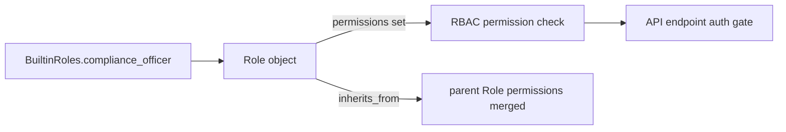

# PRD — Community 560: RBAC Built-in Role — compliance_officer

## Master Goal Mapping
**ALDECI Pillar:** Role-Based Access Control (RBAC) system — defines the `compliance_officer` built-in role with curated permission set and inheritance chain for ALDECI's 30-persona, 6-role enterprise security model.

## Architecture Diagram


## Code Proof
**File:** `suite-core/core/rbac.py:L194`  
**Module:** `rbac.BuiltinRoles.compliance_officer`

```python
@staticmethod
def compliance_officer() -> Role:
    """Manage compliance, evidence, and create reports."""
    return Role(
        name="compliance_officer",
        permissions={...},  # COMPLIANCE_MANAGE, COMPLIANCE_EVIDENCE, REPORTS_CREATE, REPORTS_EXPORT (+ analyst)
        inherits_from=security_analyst,
        org_scope=True,
        ...
    )
```

## Inter-Dependencies
- `BuiltinRoles.compliance_officer()` factory used by `RBACManager.create_default_roles()`
- `PersonaRoleMapping` — C565/C566 — maps 30 personas to these roles
- `RBACManager.check_permission()` — evaluates effective permissions
- `/api/v1/rbac` router — admin role management endpoints

## Data Flow
Factory static method → `Role` dataclass instantiation with permission set and inheritance → RBAC manager stores → permission checks at API boundaries.

## Referenced Docs
- ALDECI Rearchitecture v2 §RBAC & Persona Model
- NIST SP 800-207 (Zero Trust Architecture)
- RBAC standard (ANSI INCITS 359-2004)

## Acceptance Criteria
- [ ] Role name = `compliance_officer`
- [ ] Permission set contains exactly: COMPLIANCE_MANAGE, COMPLIANCE_EVIDENCE, REPORTS_CREATE, REPORTS_EXPORT (+ analyst)
- [ ] Inheritance from `security_analyst` correctly merges parent permissions
- [ ] `org_scope=True` (scoped to organization)
- [ ] No permission outside defined set granted

## Effort Estimate
S — 1 day per role (all implemented; add permission inheritance integration tests)

## Status
DONE — implemented at L194
